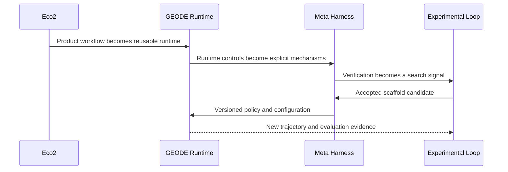
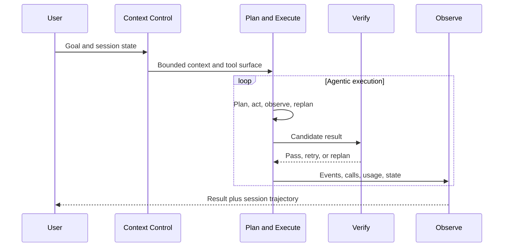
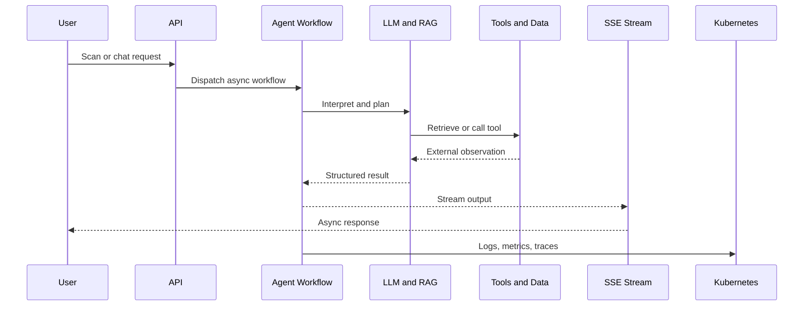
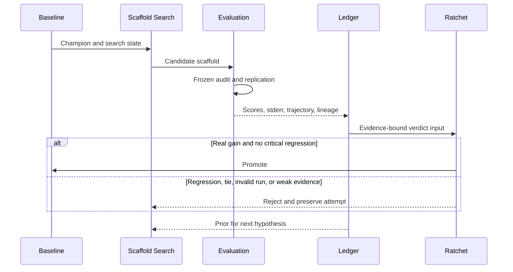
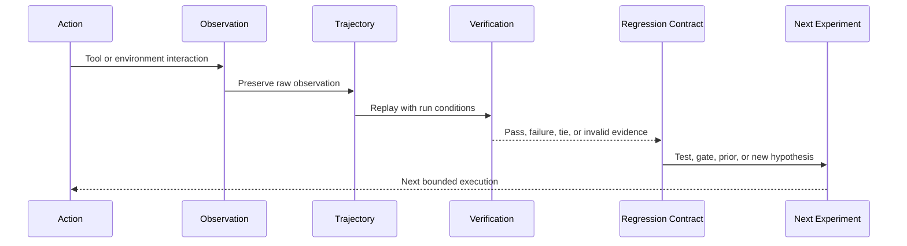

<strong>한국어</strong> · <a href="README_EN.md">English</a>

# 류지환

**실행을 검증 가능한 시스템으로 만들고, 그 결과를 다음 탐색의 입력으로 돌립니다.**

분산 스토리지와 백엔드, 클라우드 인프라를 거쳐 현재는 **자율 에이전트 런타임과 RSI(Recursive Self-Improvement) 방법론**을 다룹니다. 한 번의 성공보다 실행이 관찰 가능하고 재현 가능한지, 결과와 실패가 다음 실험의 재료로 남는지를 중요하게 봅니다.

[GEODE](https://mangowhoiscloud.github.io/geode/) · [기술 블로그](https://rooftopsnow.tistory.com) · [YouTube](https://www.youtube.com/@mango_fr) · [LinkedIn](https://linkedin.com/in/jihwan-ryu-b6b04a202)

`RSI / scaffold search` · `Autonomous agent runtime` · `Cloud / Kubernetes / IaC` · `Evidence / trajectories`

[작업 방식](#how-i-work) · [발전 과정](#evolution) · [대표 작업](#selected-work) · [검증과 기록](#evidence) · [개념](#concepts) · [이력](#experience) · [기록](#more)

## 작업 방식

**먼저 문제와 검증 범위를 좁힙니다.** 실패한 입력과 실제 호출 경로를 찾고, 무엇을 바꿀 수 있고 무엇을 보존해야 하는지 정한 뒤 가장 작은 재현 조건을 만듭니다.

**탐색에는 모델을 사용하고 판정에는 근거를 사용합니다.** AI로 가설과 구현 후보를 만들되 테스트, 원본 로그, 실행 기록과 외부 검증으로 변경의 성립 여부를 판단합니다.

**결과를 다음 탐색의 데이터로 남깁니다.** 성공한 변경, 실패한 시도, 기각된 가설, trajectory와 평가 결과를 보존합니다. 원인은 회귀 테스트로, 반복할 조사 과정은 Skill과 절차로 정리합니다.

**방법론 자체를 탐색 공간으로 둡니다.** 문제 분해, 컨텍스트, 도구 선택, 검증 순서, Skill, 에이전트 역할, 평가자 구성과 사람의 개입 지점까지 변경 후보가 됩니다. 개별 실행은 유한하게 닫되 탐색 공간은 닫지 않습니다.

## 발전 과정

Eco²에서는 실제 서비스를 운영하며 **비동기 에이전트 워크플로우와 클라우드 런타임**을 만들었습니다. GEODE에서는 이를 범용 **자율 에이전트 런타임과 메타 하네스**로 분리했습니다. 현재 Experimental Loop에서는 실행과 평가 기록을 다시 **외부 scaffold 탐색 루프**에 투입합니다.

발전의 중심은 에이전트 수가 아니라 **실행, 제어, 관찰, 개선 계층을 분리한 것**입니다.

## 대표 작업

### GEODE

장기 실행 메모리, 여러 모델 제공자 연결, 도구 실행, 권한 경계, 관찰과 평가를 갖춘 **자율 에이전트 런타임**입니다. 배포 경계는 `core`, `evals`, `evolve`로 나뉩니다. `core`는 실행, `evals`는 증거 생산, `evolve`는 실험적인 scaffold 탐색을 담당합니다.

메타 하네스는 Context Control, Plan and Execute, Verify, Observe, Scaffold로 제어 메커니즘을 구분합니다. 개념적인 분류가 아니라 실제 코드 경로와 제어 지점에 연결된 구조입니다.

컨텍스트 예산과 compaction, 동적 replan과 convergence detection, 검증 모드와 safety gate, event persistence와 session timeline을 서로 다른 계층에 두어 독립적으로 측정하고 변경할 수 있게 합니다.

[코드](https://github.com/mangowhoiscloud/geode) · [문서](https://mangowhoiscloud.github.io/geode/docs) · [메타 하네스 카탈로그](https://mangowhoiscloud.github.io/geode/docs/reference/meta-harness-catalog) · [실행과 평가 기록](https://github.com/mangowhoiscloud/geode-eval-artifacts) · [RSI 실험](https://mangowhoiscloud.github.io/geode/self-improving/)

### Eco²

재활용을 돕는 AI 서비스입니다. Vision LLM, RAG, 도구 호출, LangGraph 기반 멀티에이전트 처리, 비동기 SSE와 Kubernetes 환경을 하나의 서비스 런타임으로 연결했습니다.

Eco²에서 얻은 핵심 경험은 **모델을 서비스 런타임 안에서 운영하는 문제**였습니다. 비동기 작업, 스트리밍, 외부 데이터, 관측성, 인증, 배포 자동화와 부하 검증이 함께 움직여야 했고, 이 경험이 GEODE의 런타임과 메타 하네스 분리로 이어졌습니다.

**주요 기록:** **2025 AI 새싹톤 우수상(4th/181)**, Terraform, Ansible, ArgoCD 기반 **24노드 Kubernetes**, Scan API **1,000 VU에서 97.8%**, 별도의 ext-authz 경로 **2,500 VU에서 1,477 RPS**. VU는 실제 이용자 수가 아닙니다. 서비스 운영은 종료됐습니다.

[기술 포트폴리오](https://mangowhoiscloud.github.io/eco2/) · [프로젝트 저장소](https://github.com/eco2-team/backend)

### Experimental Loop

GEODE의 외부 루프는 모델 가중치가 아니라 **모델 주변 scaffold**를 탐색합니다. 시스템 지침, 도구 정책, Skill, 작업 분해를 후보로 만들고 고정된 측정 계층에서 평가한 뒤 승격하거나 기각합니다.

**래칫은 점수가 한 번 올랐다는 이유만으로 움직이지 않습니다.** 후보 변경과 측정 장치를 분리하고 critical dimension의 회귀를 veto하며 gain을 불확실성과 비교합니다. baseline과 result ledger를 보존하고 실패한 후보도 지우지 않습니다. 승격은 다음 baseline을 바꾸고, 기각은 같은 baseline 위에서 다른 가설을 찾게 합니다. CI에도 architecture, repo hygiene, prompt integrity, behavior, coverage 같은 deterministic ratchet을 둡니다.

[두 루프](https://mangowhoiscloud.github.io/geode/docs/concepts/two-loops) · [실험 루프](https://mangowhoiscloud.github.io/geode/docs/self-improving/loop-overview) · [공개 평가 기록](https://github.com/mangowhoiscloud/geode-eval-artifacts)

### Compiler AX Lab

AI가 만든 코드를 **원인, 변경, 실행 증거를 연결한 검토 가능한 수정안**으로 넘기는 방법을 연구합니다. 2026-09-16 공개 CPU 기록에는 **46,080개 출력값 일치**, **720개 일반 테스트**, **55개 doctest**가 남아 있습니다. 서로 다른 실행은 하나의 점수로 합치지 않고 A/B 대조 결과는 동률로 남겼습니다. CPU 검증은 NPU 성능을 뜻하지 않으며 FuriosaAI 소속 또는 승인 프로젝트가 아닙니다.

[코드와 검증 범위](https://github.com/mangowhoiscloud/compiler-ax-lab) · [회고 보고서](https://mangowhoiscloud.github.io/compiler-ax-lab/report.pdf)

### REODE @ pinxlab

GEODE에서 출발한 코드 마이그레이션 하네스입니다. OpenRewrite와 LLM 기반 문맥 수정을 결합했습니다. Java 1.8→22, Spring 4→6 대상 **5,523개 파일** 규모 서비스에서 **83/83 테스트와 프론트엔드, 백엔드 종단 검증**을 통과했습니다. 기록된 실행은 33개 자율 세션, 1,133라운드, 5시간 48분이며 해당 실행 중 사람 개입은 0회였습니다. 준비와 최종 검토가 없었다는 의미는 아닙니다.

[납품 기록 범위](docs/PROFILE_NOTES.md#reode)

## 검증, 재현, 기록

**검증은 결과의 모양이 아니라 계약을 확인합니다.** 로컬 테스트, CI, 외부 평가, 설치, 배포 확인은 서로 대체하지 않습니다. 각 기록에는 무엇을 확인했는지 범위를 붙입니다.

**재현은 조건을 고정하는 데서 시작합니다.** 모델 경로, harness revision, task set, effort, timeout, seed, attempt lineage처럼 결과를 바꿀 수 있는 조건을 실행 기록에 묶습니다. baseline과 candidate는 같은 측정 조건을 공유하고 오류나 quota로 오염된 실행은 분리합니다.

**trajectory는 연구 데이터입니다.** 요청, 도구 호출, 외부 observation, 실패와 retry, 최종 verdict가 하나의 실행 궤적을 이룹니다. 성공 trajectory는 어떤 제어가 작동했는지 보여주고, 실패 trajectory는 회귀 테스트와 mutation hypothesis의 재료가 됩니다. 공개 기록은 원본을 우선하고 provenance와 privacy review를 함께 관리합니다.

**래칫은 기억을 자동화합니다.** 이해한 실패는 회귀 테스트나 deterministic check로 고정하고, 승격된 baseline은 다음 비교의 기준으로 사용합니다. 검사가 실패했을 때 threshold를 먼저 낮추지 않고 원인을 조사합니다.

## 개념

**에이전트**는 도구를 사용해 작업을 진행합니다. **하네스**는 도구, 메모리, 권한, 실패 처리와 검증을 관리합니다. **메타 하네스**는 그 하네스 자체를 관찰 가능하고 제한 가능하며 발전 가능한 대상으로 만드는 제어 계층입니다. **RSI(Recursive Self-Improvement)**는 여기서 이전 실행의 증거를 이후 변경과 실험으로 되돌리는 문제를 뜻하며, 변경 채택과 반복 개선은 별개의 증거를 요구합니다.

<strong>그 밖의 작업</strong>

**Kiki @ pinxlab · 2026.04–05:** Slack 기반 다중 에이전트 분석, 구현, 리뷰와 2단계 게이트.  
**Cotton @ pinxlab · 2026.05:** 대화를 그래프로 모델링한 RPG 번역 SaaS.  
**[Crumb & Crumb Studio](https://github.com/mangowhoiscloud/crumb) · 2026.05:** replay 가능한 CLI 에이전트 게임 제작 실험.  
**[DREAM](https://github.com/KakaoTech-Hackathon-Dream) · 2024.09:** 생성형 AI 서사와 이미지 서비스.  
**[Aimo](https://github.com/KTB16Team) · 2024:** LLM 기반 갈등 중재 백엔드.

## 이력

| 기간 | 경험 |
| --- | --- |
| 2026.09 | **Compiler AX Lab** · CPU 테스트와 개발 워크플로우 연구 |
| 2026.02–현재 | **GEODE** · 단독 개발 · SIL 2026.05–06 · Crucible 2026.07–현재 |
| 2026.03–05 | **pinxlab** · 프리랜스 · REODE, Kiki, Cotton |
| 2025.10–2026.02 | **Eco²** · 백엔드와 인프라에서 단독 고도화와 운영으로 확장 · 2025 AI 새싹톤 우수상 |
| 2024.12–2025.08 | **Rakuten Symphony Korea** · Jr. Cloud Engineer, Storage Developer · PB 규모 분산 스토리지 |
| 2024.07–11 | **카카오테크 부트캠프** · 백엔드, DevOps, LLM |
| 2017.03–2023.08 | **부산대학교 정보컴퓨터공학부** · 학사 |

Rakuten에서는 **Rakuten Cloud Native Platform, Storage Server v5.5.0 · Rakuten Storage v1.0.0** 경험을 쌓았습니다.

## 기록

구현과 실험 기록은 [블로그](https://rooftopsnow.tistory.com)와 [YouTube](https://www.youtube.com/@mango_fr)에 정리합니다. [LinkedIn](https://linkedin.com/in/jihwan-ryu-b6b04a202) · 이전 GitHub 계정: [@mng990](https://github.com/mng990)

내용 검토: 2026-09-17 · <a href="docs/PROFILE_NOTES.md">수치의 출처, 범위와 업데이트 원칙</a>

