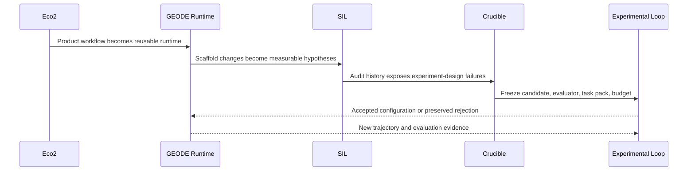
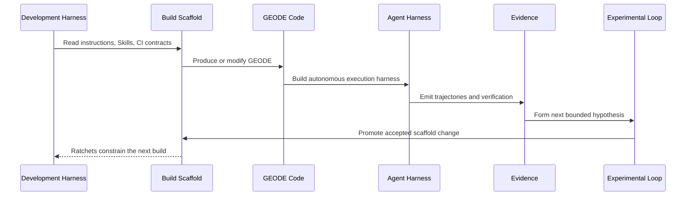
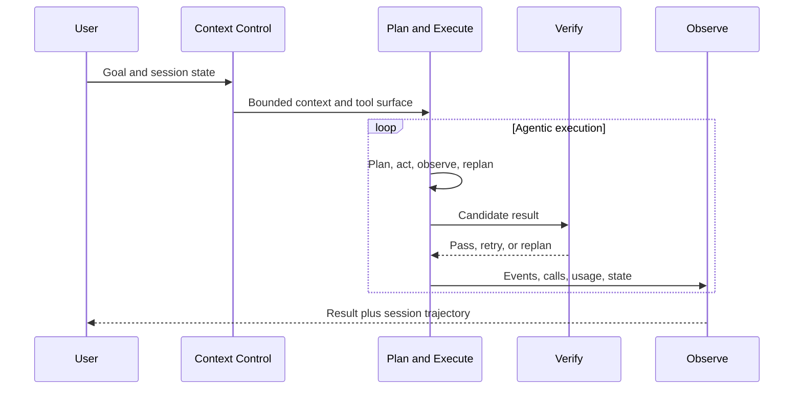
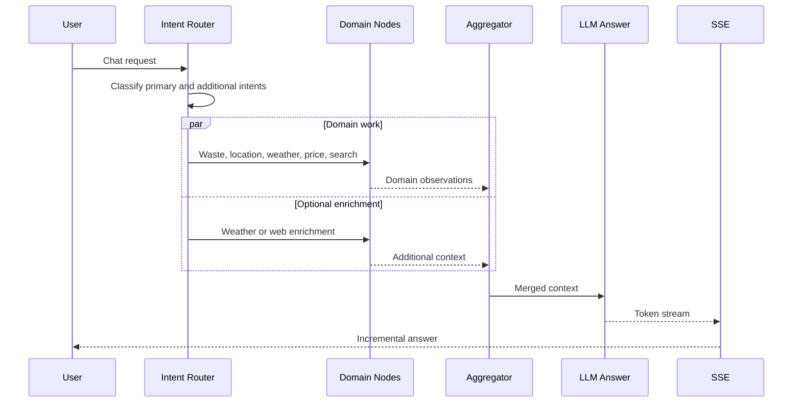
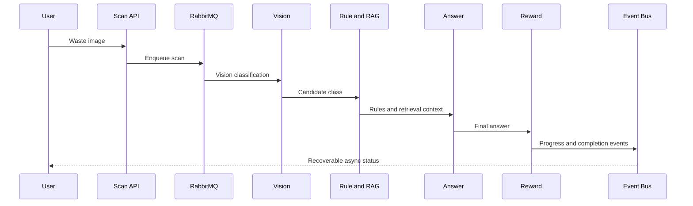
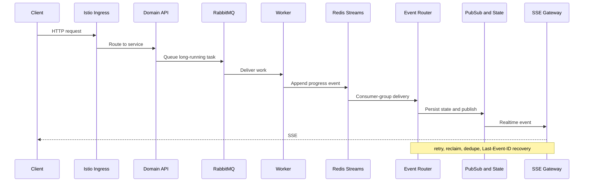
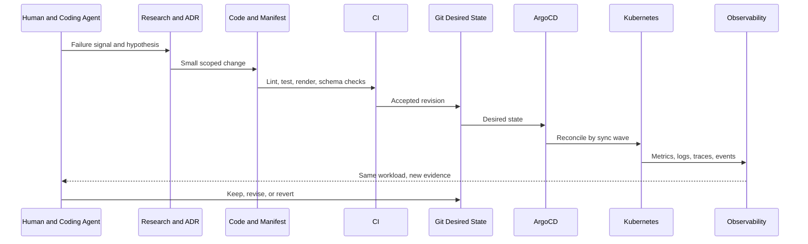
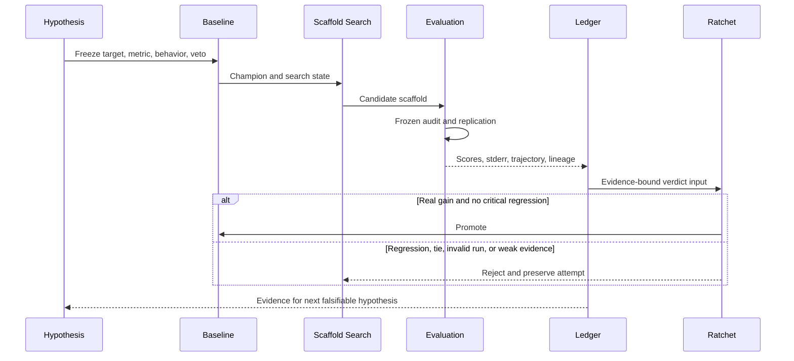
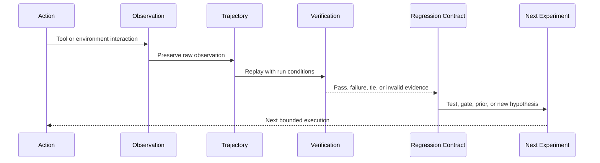

<p align="right"><strong>한국어</strong> · <a href="README_EN.md">English</a></p>

# 류지환

**실행을 검증 가능한 시스템으로 만들고, 그 결과를 다음 탐색의 입력으로 돌립니다.**

분산 스토리지와 백엔드, 클라우드 인프라를 거쳐 현재는 **자율 에이전트 런타임과 RSI(Recursive Self-Improvement) 방법론**을 다룹니다. 한 번의 성공보다 실행이 관찰 가능하고 재현 가능한지, 결과와 실패가 다음 실험의 재료로 남는지를 중요하게 봅니다.

[GEODE](https://mangowhoiscloud.github.io/geode/) · [기술 블로그](https://rooftopsnow.tistory.com) · [YouTube](https://www.youtube.com/@mango_fr) · [LinkedIn](https://linkedin.com/in/jihwan-ryu-b6b04a202)

[](https://github.com/mangowhoiscloud/geode/releases/latest)

`RSI / scaffold search` · `Autonomous agent runtime` · `Cloud / Kubernetes / IaC` · `Evidence / trajectories`

[작업 방식](#how-i-work) · [발전 과정](#evolution) · [대표 작업](#selected-work) · [검증과 기록](#evidence) · [개념](#concepts) · [이력](#experience) · [기록](#more)

<a id="how-i-work"></a>
## 작업 방식

**아이디어를 먼저 틀릴 수 있는 문장으로 바꿉니다.** “더 좋아질 것이다”는 실험이 아닙니다. 대상, 비율 또는 기준, 관찰할 행동과 결과를 먼저 정합니다. 제품 가설에서 `Y의 X%는 Z를 할 것이다`라고 쓰는 것과 같은 원리입니다. 에이전트 연구에서는 이를 `어떤 task family에서, 어떤 candidate가, 어떤 frozen metric과 veto를 통과할 것인가`로 번역합니다. 측정할 수 없는 기대는 승격 근거로 사용하지 않습니다.

**먼저 문제와 검증 범위를 좁힙니다.** 실패한 입력과 실제 호출 경로를 찾고, 무엇을 바꿀 수 있고 무엇을 보존해야 하는지 정한 뒤 가장 작은 재현 조건을 만듭니다.

**탐색에는 모델을 사용하고 판정에는 근거를 사용합니다.** AI로 가설과 구현 후보를 만들되 테스트, 원본 로그, 실행 기록과 외부 검증으로 변경의 성립 여부를 판단합니다.

**결과를 다음 탐색의 데이터로 남깁니다.** 성공한 변경, 실패한 시도, 기각된 가설, trajectory와 평가 결과를 보존합니다. 원인은 회귀 테스트로, 반복할 조사 과정은 Skill과 절차로 정리합니다.

**방법론 자체를 탐색 공간으로 둡니다.** 문제 분해, 컨텍스트, 도구 선택, 검증 순서, Skill, 에이전트 역할, 평가자 구성과 사람의 개입 지점까지 변경 후보가 됩니다. 개별 실행은 유한하게 닫되 탐색 공간은 닫지 않습니다.

<a id="evolution"></a>
## 발전 과정

Eco²에서는 실제 서비스를 운영하며 **비동기 에이전트 워크플로우와 클라우드 런타임**을 만들었습니다. GEODE에서는 이를 범용 **자율 에이전트 런타임**으로 분리했고, 별도의 제작 계층을 **메타 하네스**로 다루기 시작했습니다. 여기서 메타 하네스는 런타임을 감싸는 상위 제어기가 아니라, 하네스의 코드와 scaffold를 만들고 검증하고 다시 고치는 **하네스 제작 장치**를 뜻합니다. SIL에서는 “scaffold 변경이 안전성 기준을 개선하는가”를 외부 audit로 측정했고, Crucible에서는 그 경험을 바탕으로 **candidate, evaluator, task pack, budget을 먼저 동결하는 실험 계약**으로 발전시켰습니다. 현재 Experimental Loop에서는 실행과 평가 기록을 다시 외부 scaffold 탐색 루프에 투입합니다.



이 과정에서 중요한 변화는 “좋아 보이는 변경”을 만드는 능력이 아니라 **가설을 반증 가능하게 만들고, 실패가 다음 실험의 설계를 바꾸게 하는 능력**이었습니다.

### SIL에서 Crucible로

SIL은 Petri 계열의 다차원 safety audit와 critical-dimension floor를 사용해 scaffold 후보를 검사했습니다. 이 단계에서 생성, audit, promotion, revert를 하나의 루프로 닫고 실행 transcript와 비용을 남기는 기반을 만들었습니다.

Crucible의 2026년 7월 캠페인은 더 중요한 반례를 만들었습니다. 서로 다른 candidate revision에서 통과한 row를 이어 붙이면 겉으로는 target set이 닫혀 보여도, 마지막 candidate가 이전 row 전체에서 다시 검증된 것은 아니었습니다. 노출한 G4 row를 수정해 다시 쓰는 순간 그것은 held-out evidence가 아니라 training counterexample이 됐고, 천 개가 넘는 gate artifact와 수천만 token도 candidate, evaluator, task set, cost window가 함께 동결되지 않으면 재현 가능한 champion을 만들지 못했습니다.

그래서 현재 Crucible은 한 candidate commit, 한 evaluator/harness identity, content-bound task pack, paired comparison rule, budget과 veto를 **실행 전에 고정**합니다. 결과는 `KEEP`, `REJECT`, `INVALID`로 나뉘며 infrastructure failure를 낮은 task score로 바꾸지 않습니다. 실패한 train row는 다음 candidate의 counterexample이 되지만, 한 번 본 sealed row는 같은 promotion claim에 다시 쓰지 않습니다.

[Crucible frozen experiment kernel](https://github.com/mangowhoiscloud/geode/blob/main/docs/architecture/crucible-kernel.md) · [Self-Improving Roadmap](https://github.com/mangowhoiscloud/geode/blob/main/docs/plans/2026-05-22-self-improving-roadmap.md)

### RSI를 향한 현재 위치

RSI는 목표 방향이지 현재 달성 상태를 뜻하지 않습니다. 2026-05-22의 Self-Improving Roadmap은 `outer loop → inner memory/recall → cognitive loop` 순서로 문제를 분해했던 역사적 로드맵이며, 현재 문서 자체도 active execution ledger가 아니라 provenance라고 명시합니다. 지금은 그 초기 계획에서 **outer loop를 실행 가능한 실험 시스템으로 만들고, 그 과정에서 measurement와 promotion authority를 분리하는 단계**까지 왔습니다.

현재 위치를 간단히 쓰면 다음과 같습니다.

```text
service runtime
  -> autonomous agent runtime
  -> autonomous agent harness\n  -> meta-harness: harness-building system
  -> SIL: safety-scaffold audit loop
  -> Crucible: frozen experiment + promotion ratchet   [current]
  -> repeated cross-task evidence and retained improvements
  -> broader recursive improvement across methodology [direction]
```

따라서 “RSI를 구현했다”가 아니라 **RSI를 지향하며, 반복 개선을 주장할 수 있는 실험 조건부터 구축하고 있다**고 표현합니다. 다음 단계의 핵심은 한 번의 KEEP이 아니라 서로 다른 task family와 새 sealed evidence에서 retained change가 다시 유효한지 확인하는 것입니다.

<a id="selected-work"></a>
## 대표 작업

### GEODE

장기 실행 메모리, 여러 모델 제공자 연결, 도구 실행, 권한 경계, 관찰과 평가를 갖춘 **자율 에이전트 런타임**입니다. 배포 경계는 `core`, `evals`, `evolve`로 나뉩니다. `core`는 실행, `evals`는 증거 생산, `evolve`는 실험적인 scaffold 탐색을 담당합니다.

GEODE에서 **하네스**와 **메타 하네스**는 같은 층이 아닙니다. 하네스는 Context Control, Plan and Execute, Verify, Observe를 통해 실제 에이전트 실행을 수렴시킵니다. 메타 하네스는 그 하네스를 **제작하는 장치**입니다. Claude Code나 Codex CLI 같은 개발 하네스가 `CLAUDE.md`, `AGENTS.md`, 개발 Skill, CI와 ratchet을 읽어 GEODE의 코드와 runtime scaffold를 생산하고 수정합니다.

그래서 `Scaffold`는 런타임 제어 항목 하나가 아니라 **제작 측면의 계약**입니다. 런타임에서 검증된 패턴이 제작 라인으로 올라가고, 제작 과정에서 발견된 실패는 테스트, 지침, CI ratchet으로 고정됩니다. self-improving outer loop가 runtime scaffold를 변이하고 audit한 뒤 승격 또는 revert하는 단계에서는 이 관계가 재귀적으로 닫힙니다. 다만 PR merge와 release 권한은 운영자 게이트에 남습니다.



이 의미에서 meta는 단순히 “더 위에서 관찰한다”는 뜻이 아니라 **하네스를 대상으로 삼아 하네스를 만들어 내는 층**이라는 뜻에 가깝습니다.



컨텍스트 예산과 compaction, 동적 replan과 convergence detection, 검증 모드와 safety gate, event persistence와 session timeline을 서로 다른 계층에 두어 독립적으로 측정하고 변경할 수 있게 합니다.

[코드](https://github.com/mangowhoiscloud/geode) · [문서](https://mangowhoiscloud.github.io/geode/docs) · [메타 하네스 카탈로그](https://mangowhoiscloud.github.io/geode/docs/reference/meta-harness-catalog) · [실행과 평가 기록](https://github.com/mangowhoiscloud/geode-eval-artifacts) · [RSI 실험](https://mangowhoiscloud.github.io/geode/self-improving/)

### Eco²

재활용을 돕는 AI 서비스입니다. Eco²는 하나의 “에이전트”가 아니라 **서로 다른 실행 계약을 가진 워크플로우, 클러스터, 그리고 그것을 바꾸는 제작 라인**으로 보는 편이 정확합니다. 현재 코드 기준 Chat은 10개 intent를 분류해 필요한 노드를 병렬 fan-out하고, Scan은 Vision → Rule/RAG → Answer → Reward의 Celery chain을 사용합니다. 이미지 생성은 별도 branch로 실행됩니다.

#### 용도별 에이전트 워크플로우



Chat은 **질문을 분해하고 필요한 도메인 작업을 병렬 합류시키는 workflow**입니다. 반복형 ReAct subagent 여러 개가 자유롭게 도는 구조로 과장하지 않습니다. 현재 production wiring은 대부분 한 번의 structured/function call로 인자를 정한 뒤 deterministic application command를 실행합니다.



Scan은 대화형 routing보다 **비동기 작업 파이프라인**에 가깝습니다. 긴 작업은 RabbitMQ/Celery가 소유하고, 진행 이벤트는 이후 Redis Streams, Event Router, Pub/Sub, SSE Gateway로 분리했습니다. 작업 실행과 client connection의 수명을 분리한 것이 핵심입니다.

#### 클러스터와 이벤트 전달 구조

검증 팩트 기준으로는 **EC2 20노드, 19개 마이크로서비스(9 API + 9 Worker + ext-authz)** 규모입니다. 기존 README의 24-node 표기는 내부 architecture facts와 불일치해 여기서는 코드와 검증 문서에 맞춘 20 EC2를 사용합니다. Istio가 edge/service traffic을, RabbitMQ가 task plane을, Redis가 event/recovery plane을, KEDA가 workload별 scaling을 맡습니다.



이 구조는 “Redis를 썼다”보다 **권한과 수명을 분리했다**는 점이 중요합니다. RabbitMQ는 task orchestration, Event Router는 ACK/reclaim, State/Streams는 replay와 recovery, SSE Gateway는 client connection을 소유합니다. KEDA는 queue, pending, connection 같은 workload signal로 replica를 조정하고 ArgoCD는 replica field와 충돌하지 않도록 desired-state 책임을 분리합니다.

#### 배포 구조와 Eco²의 메타 하네스

Eco²에도 GEODE로 이어지는 **하네스 제작 장치의 초기 형태**가 있었습니다. 다만 runtime이 스스로 source를 고치는 자기개선 시스템은 아니었습니다. 사람이 coding agent와 함께 research/ADR에서 변경 가설을 만들고, CI가 code와 manifest를 검사하고, Git desired state를 ArgoCD가 cluster에 reconcile한 뒤, 같은 workload와 observability signal로 다시 측정해 사람이 keep/revise/revert를 결정했습니다.



배포 측면에서는 Terraform/Ansible로 기반을 만들고, Kubernetes manifest와 Git을 desired state로 두며, ArgoCD의 sync wave로 Redis, RabbitMQ, KEDA, Gateway, Router 같은 의존 순서를 관리했습니다. Prometheus/Grafana, EFK, Jaeger/OTEL, LangSmith가 서로 다른 관측면을 제공했습니다. 이때 observability는 승인 권한이 아니라 **다음 변경을 만들기 위한 feedback surface**였습니다.

이 경험이 GEODE에서 더 명시적인 메타 하네스로 발전했습니다. Eco²에서는 `failure → hypothesis → code/manifest → CI → Git/ArgoCD → remeasure → human verdict`가 사람과 coding agent가 함께 돌리는 외부 engineering loop였다면, GEODE에서는 제작 scaffold, trajectory, revision-bound evaluation, ratchet과 promotion contract를 별도 구조로 만들고 있습니다.

**주요 기록:** **2025 AI 새싹톤 우수상(4th/181)**. Scan workload의 보존된 k6 결과 중 최종 VU 1,000 실행은 **1,469/1,518 완료, 97.8%**였고 같은 날 이전 실행에는 0% 회귀도 남아 있습니다. 따라서 이를 선형적인 성능 향상으로 표현하지 않습니다. 서비스 운영은 종료됐습니다.

[기술 포트폴리오](https://mangowhoiscloud.github.io/eco2/) · [프로젝트 저장소](https://github.com/eco2-team/backend)

### Experimental Loop

GEODE의 외부 루프는 모델 가중치가 아니라 **모델 주변 scaffold**를 탐색합니다. 시스템 지침, 도구 정책, Skill, 작업 분해를 후보로 만들고 고정된 측정 계층에서 평가한 뒤 승격하거나 기각합니다.



**래칫은 점수가 한 번 올랐다는 이유만으로 움직이지 않습니다.** 후보 변경과 측정 장치를 분리하고 critical dimension의 회귀를 veto하며 gain을 불확실성과 비교합니다. baseline과 result ledger를 보존하고 실패한 후보도 지우지 않습니다. 승격은 다음 baseline을 바꾸고, 기각은 같은 baseline 위에서 다른 가설을 찾게 합니다.

[두 루프](https://mangowhoiscloud.github.io/geode/docs/concepts/two-loops) · [실험 루프](https://mangowhoiscloud.github.io/geode/docs/self-improving/loop-overview) · [공개 평가 기록](https://github.com/mangowhoiscloud/geode-eval-artifacts)

### Harbor rollout에서 배운 것

외부 benchmark를 붙이는 일도 같은 방식으로 다룹니다. “Harbor가 붙었다”가 가설의 끝이 아니라, **어떤 실패를 보존하고 어떤 단위로 계산하며 어떤 evidence에 권한을 줄 것인가**를 다시 정의하는 계기가 됐습니다.

v1.0.28 준비 과정에서는 실제 rollout과 통합 초안을 대조하면서 여러 결함 지점을 찾았습니다. cache read/write의 포함 관계와 비용 표시가 UI까지 일관되게 전달되지 않았고, Harbor의 정리 단계에서 난 2차 오류가 원래 실행 오류를 가릴 수 있었으며, 성능 실패의 원시 표본이 충분히 남지 않았습니다. 문서와 최신 verifier 계약의 drift, 이미 대체된 오래된 통합 초안도 함께 분리했습니다. whole-runtime usage와 Reflexion 효능처럼 아직 관측하지 못한 것은 완료로 표시하지 않았습니다.

수정은 “성공률을 높였다”가 아니라 **측정 장치를 고쳤다**는 데 의미가 있습니다. 최초 실행 오류를 우선 보존하고, cache accounting의 owner와 denominator를 명시하고, raw sample과 진단을 남기고, superseded 변경을 재적용하지 않았습니다. 이후 Terminal-Bench 2.1 smoke에서는 run spec을 사전 동결한 뒤 Harbor 0.22.0에서 한 task를 한 번 실행해 reward **1/1**, verifier **6/6**, Harbor error/retry **0/0**, tool call/result **2/2, orphan 0**을 기록했습니다. 이 결과도 1/89 task, k=1의 account-scoped smoke일 뿐 suite 성능으로 확대하지 않습니다.

[Harbor gap closure PR #3311](https://github.com/mangowhoiscloud/geode/pull/3311) · [Terminal-Bench Astra smoke](https://github.com/mangowhoiscloud/geode/blob/main/docs/eval/2026-09-05-terminalbench-astra-openssl-smoke.md)

### REODE @ pinxlab

GEODE에서 출발한 코드 마이그레이션 하네스입니다. OpenRewrite와 LLM 기반 문맥 수정을 결합했습니다. Java 1.8→22, Spring 4→6 대상 **5,523개 파일** 규모 서비스에서 **83/83 테스트와 프론트엔드, 백엔드 종단 검증**을 통과했습니다. 기록된 실행은 33개 자율 세션, 1,133라운드, 5시간 48분이며 해당 실행 중 사람 개입은 0회였습니다. 준비와 최종 검토가 없었다는 의미는 아닙니다.

[납품 기록 범위](docs/PROFILE_NOTES.md#reode)

<a id="evidence"></a>
## 검증, 재현, 기록

**검증은 결과의 모양이 아니라 계약을 확인합니다.** 로컬 테스트, CI, 외부 평가, 설치, 배포 확인은 서로 대체하지 않습니다. 각 기록에는 무엇을 확인했는지 범위를 붙입니다.

**재현은 조건을 고정하는 데서 시작합니다.** 모델 경로, harness revision, task set, effort, timeout, seed, attempt lineage처럼 결과를 바꿀 수 있는 조건을 실행 기록에 묶습니다. baseline과 candidate는 같은 측정 조건을 공유하고 오류나 quota로 오염된 실행은 분리합니다.

**trajectory는 연구 데이터입니다.** 요청, 도구 호출, 외부 observation, 실패와 retry, 최종 verdict가 하나의 실행 궤적을 이룹니다. 성공 trajectory는 어떤 제어가 작동했는지 보여주고, 실패 trajectory는 회귀 테스트와 mutation hypothesis의 재료가 됩니다. 공개 기록은 원본을 우선하고 provenance와 privacy review를 함께 관리합니다.



**래칫은 기억을 자동화합니다.** 이해한 실패는 회귀 테스트나 deterministic check로 고정하고, 승격된 baseline은 다음 비교의 기준으로 사용합니다. 검사가 실패했을 때 threshold를 먼저 낮추지 않고 원인을 조사합니다.

<a id="concepts"></a>
## 개념

**에이전트**는 도구를 사용해 작업을 진행합니다. **하네스**는 도구, 메모리, 권한, 실패 처리와 검증을 관리합니다. **메타 하네스**는 하네스를 대상으로 삼아 그 코드와 scaffold를 제작, 검증, 수정하는 제작 시스템입니다. GEODE에서는 개발 하네스, instruction scaffold, Skills, CI ratchet이 이 제작 라인을 이루며, runtime evidence가 다음 제작 변경으로 되먹임됩니다. **RSI(Recursive Self-Improvement)**는 여기서 이전 실행의 증거를 이후 변경과 실험으로 되돌리는 문제를 뜻하며, 변경 채택과 반복 개선은 별개의 증거를 요구합니다.

<details>
<summary><strong>그 밖의 작업</strong></summary>

**Kiki @ pinxlab · 2026.04–05:** Slack 기반 멀티에이전트 분석, 구현, 리뷰와 2단계 검증 게이트.  
**Cotton @ pinxlab · 2026.05:** RPG 번역 SaaS. 대화를 그래프로 모델링.  
**[Crumb & Crumb Studio](https://github.com/mangowhoiscloud/crumb) · 2026.05:** replay 가능한 CLI 에이전트 게임 스튜디오 실험.  
**[DREAM](https://github.com/KakaoTech-Hackathon-Dream) · 2024.09:** 생성형 AI 서사와 이미지 서비스.  
**[Aimo](https://github.com/KTB16Team) · 2024:** LLM 기반 갈등 중재 백엔드.

</details>

<a id="experience"></a>
## 이력

| 기간 | 경험 |
| --- | --- |
| 2026.02–현재 | **GEODE** · 단독 개발 · SIL 2026.05–06 · Crucible 2026.07–현재 |
| 2026.03–05 | **pinxlab** · 프리랜서 · REODE, Kiki, Cotton |
| 2025.10–2026.02 | **Eco²** · 백엔드/인프라에서 단독 개발·운영까지 · 2025 AI 새싹톤 우수상 |
| 2024.12–2025.08 | **Rakuten Symphony Korea** · Jr. Cloud Engineer, Storage Developer · PB급 분산 스토리지 |
| 2024.07–11 | **Kakao Tech Bootcamp** · Backend, DevOps, LLM |
| 2017.03–2023.08 | **부산대학교** · 컴퓨터공학 학사 |

Rakuten에서는 **Rakuten Cloud Native Platform, Storage Server v5.5.0 · Rakuten Storage v1.0.0**에 참여했습니다.

<a id="more"></a>
## 기록

구현 과정과 실험에서 얻은 내용은 [블로그](https://rooftopsnow.tistory.com)와 [YouTube](https://www.youtube.com/@mango_fr)에 남깁니다. [LinkedIn](https://linkedin.com/in/jihwan-ryu-b6b04a202) · 이전 GitHub 계정: [@mng990](https://github.com/mng990)

<sub>내용 검토: 2026-09-17 · <a href="docs/PROFILE_NOTES.md">수치의 출처와 범위</a></sub>

[](https://github.com/mangowhoiscloud/mangowhoiscloud/actions/workflows/profile.yml)
