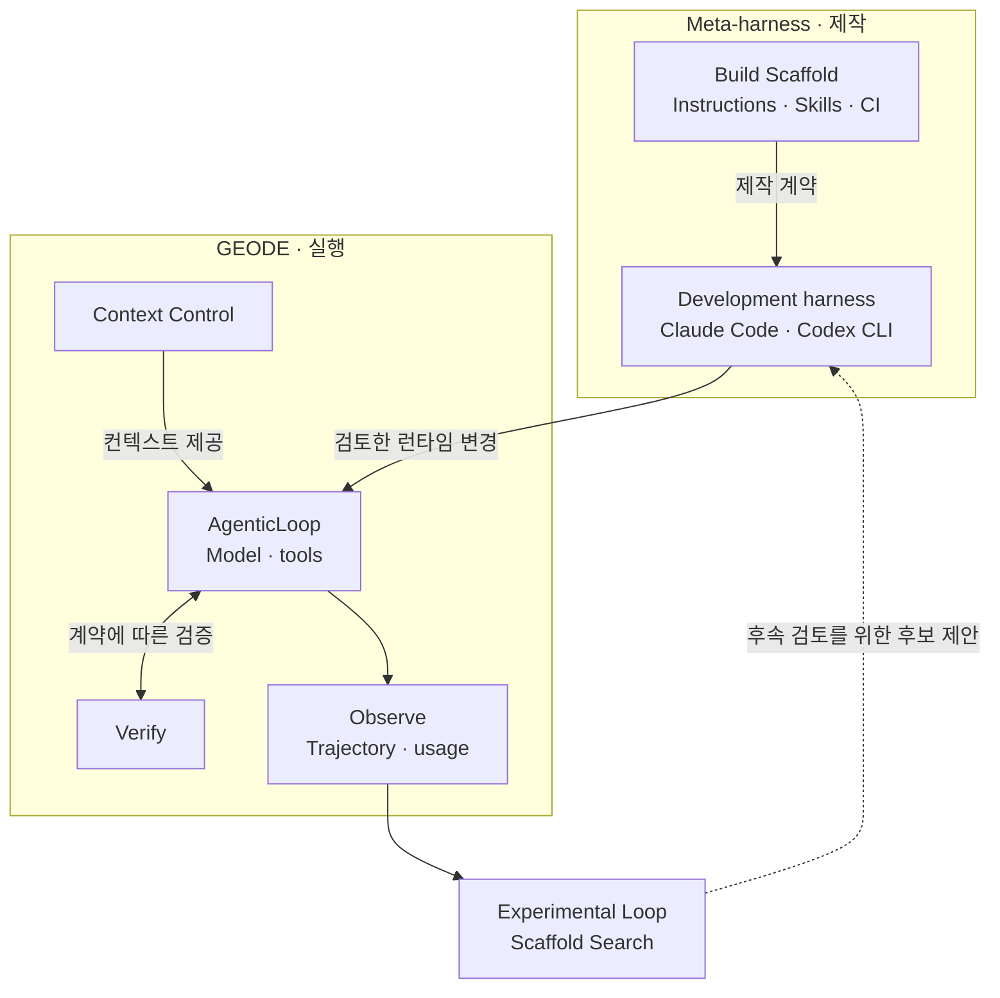
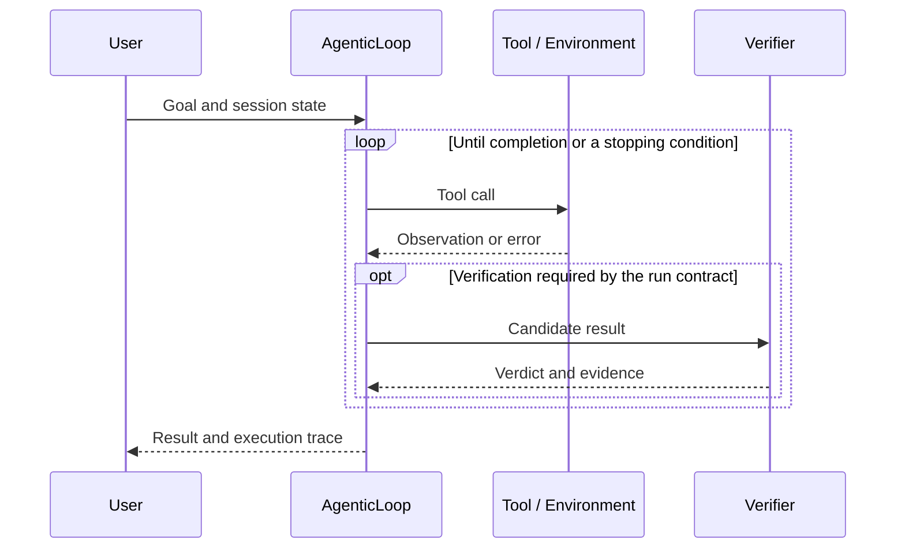
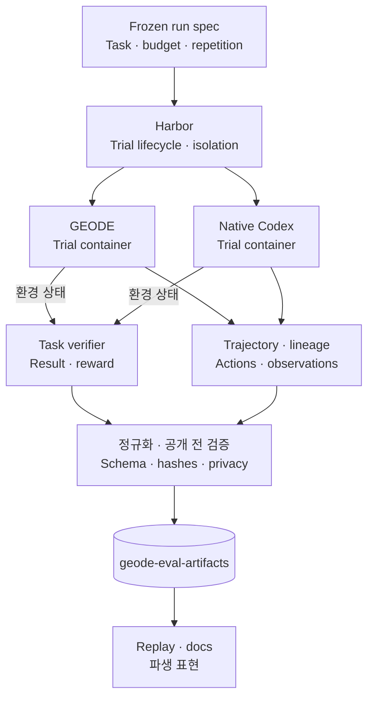
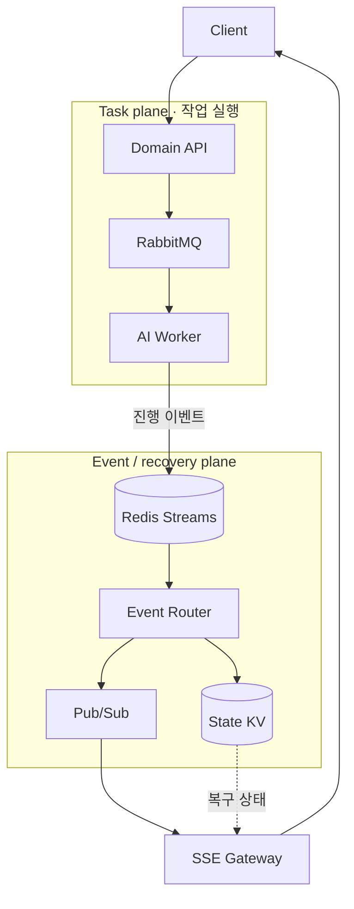
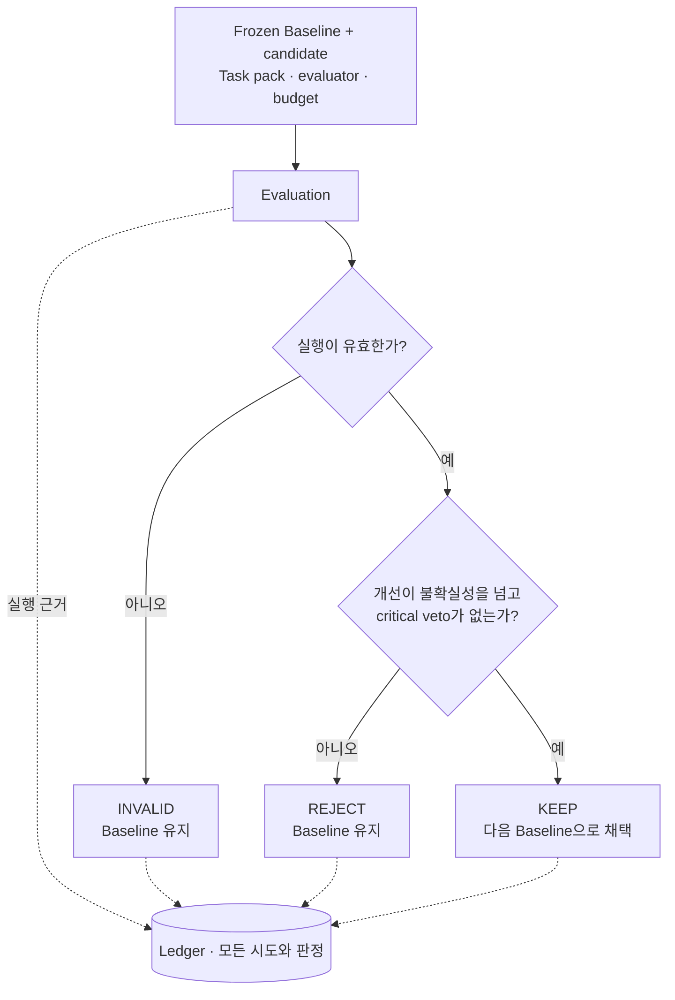

<strong>한국어</strong> · <a href="README_EN.md">English</a>

# 류지환

**에이전트의 실행을 만들고, 변경의 효과를 검증합니다.**

분산 스토리지와 백엔드, 클라우드 인프라를 거쳐 자율 에이전트 런타임과 평가 시스템을 개발합니다. 도구 호출이 실패했을 때 원인을 추적할 수 있는지, 코드나 scaffold를 바꾼 뒤 같은 조건에서 결과가 나아지는지를 다룹니다.

[GEODE](https://mangowhoiscloud.github.io/geode/) · [블로그](https://rooftopsnow.tistory.com) · [YouTube](https://www.youtube.com/@mango_fr) · [LinkedIn](https://linkedin.com/in/jihwan-ryu-b6b04a202)

[대표 작업](#selected-work) · [발전 과정](#evolution) · [작업 방식](#how-i-work) · [검증과 기록](#evidence) · [이력](#experience)

## 대표 작업

### GEODE · 실행과 제작의 경계

장기 세션의 메모리, 모델 연결, 도구 실행, 권한과 검증을 관리하는 **자율 에이전트 런타임**입니다. `core`는 실행을, `evals`는 측정을, `evolve`는 실험적인 scaffold 탐색을 맡습니다.

런타임을 만드는 시스템도 별도로 다룹니다. 여기서 **메타 하네스는 하네스의 코드와 scaffold를 제작·검증·수정하는 장치**입니다. Claude Code나 Codex CLI가 `AGENTS.md`, `CLAUDE.md`, Skills와 CI 계약을 읽어 GEODE를 고칩니다. 실행 위에 놓인 또 하나의 제어기를 뜻하지 않습니다.

실행 기록은 다음 변경의 근거가 됩니다. **변경 후보의 채택과 PR merge·release 승인은 별개**이며, 배포 권한은 운영자에게 남습니다.

한 실행에서는 무엇이 반복되는가

아래는 호출과 응답의 시간순서가 중요한 구간입니다. 컨텍스트 구성과 compaction은 런타임이 관리하고, 검증은 해당 실행의 계약에 따라 수행합니다.

모델의 완료 선언, 검증 결과, 실행 종료 사유를 같은 값으로 취급하지 않습니다. 컨텍스트·실행·검증·관측을 나누면 어느 부분의 변경이 결과에 영향을 줬는지 조사할 수 있습니다.

[코드](https://github.com/mangowhoiscloud/geode) · [문서](https://mangowhoiscloud.github.io/geode/docs) · [메타 하네스 카탈로그](https://mangowhoiscloud.github.io/geode/docs/reference/meta-harness-catalog) · [평가 기록](https://github.com/mangowhoiscloud/geode-eval-artifacts)

#### Harbor · 점수 차이를 실행 기록으로 조사하기

Terminal-Bench 2.1에서 GEODE와 native Codex를 **paired rollout**으로 비교했습니다. 두 arm은 같은 task·repetition에 배정되지만, 매 시도마다 별도 컨테이너에서 독립적으로 작업합니다. Codex의 행동을 GEODE가 따라 하는 실행이나 실서비스 shadow traffic은 아닙니다.

계획은 **89 tasks × 5 repetitions × 2 arms = 890 cells**였습니다. Cell은 `task × repetition × arm`이며, 두 arm 모두 OpenAI subscription의 `gpt-5.6-sol`, 요청 effort `max`를 사용했습니다. 당시 GEODE arm은 `AgenticLoop`에 Harbor 기반 `terminal_exec` 하나를 연결한 구성입니다. 이후 full-runtime 실험과 구분합니다.

Harbor가 컨테이너·timeout·task verifier를 관리합니다. **Score는 verifier 결과와 동결된 선정 규칙으로 계산하고, trajectory는 도구 호출과 실패 경로를 조사하는 데 씁니다.** 그림의 분기는 두 arm의 독립성을 나타내며 동시 실행을 뜻하지 않습니다.

공통 유효 429쌍의 보조 관측에서 **통과 건수는 GEODE 339/429, Codex 331/429**입니다. 환경 문제로 제외·미해결 cell이 남아 사전 정의한 전체 평가값은 측정 불성립입니다. 공식 leaderboard 순위나 현재 GEODE 전체 런타임의 우위로 제시하지 않습니다.

[실행 계약과 한계](https://github.com/mangowhoiscloud/geode/blob/main/docs/eval/terminal-bench-2.md) · [공개 run artifact](https://github.com/mangowhoiscloud/geode-eval-artifacts/tree/main/terminal-bench/terminalbench21-sol-max-fullsuite-paired-20260827t190300z) · [GEODE / Codex replay](https://mangowhoiscloud.github.io/geode/benchmarks/terminal-bench/replay/)

어떤 데이터를 남겼고, 측정 장치는 어떻게 보강했는가

| 데이터 | 공개 파일 | 읽는 목적 |
| --- | --- | --- |
| 실행 계약 | `run-spec.json`, `task-manifest.json` | 모델·task·예산과 비교 범위를 확인합니다. |
| 시도 이력 | `attempts.jsonl` | 원래 시도와 보충 시도, 유효성·선정 여부를 추적합니다. |
| 행동 기록 | `trajectory.json`, replay 파생물 | 보존된 ATIF·세션 기록을 바탕으로 행동의 순서와 출처를 조사합니다. |
| 채점 근거와 분석 | `native-results.json`, `verifier-receipts.json`, `outcomes.json`, `analysis.json` | 원본 reward, 계약상 선정 결과, 집계의 분모를 확인합니다. |
| 공개 명세 | `publication*.json` | 공개 대상 파일·hash와 검증 범위를 확인합니다. |

원본 job은 비공개로 보존하고, schema·lineage·hash와 secret·PII·로컬 경로를 검사한 파생물을 공개합니다. ATIF에서 복원한 `recording.cast`는 **derived replay**이지 당시 PTY 원본 녹화가 아닙니다. Observer PTY는 실행 절차의 별도 기록입니다. 공개 replay가 모든 prompt·출력 본문을 담는 것도 아니며, 이후 재실행으로 과거의 누락 기록이나 점수를 덮어쓰지 않습니다.

후속 통합 점검에서는 inclusive-input 비용 추정의 cache-write 분리 누락, cleanup 오류가 최초 실행 오류를 가리는 경로, 성능 검사 실패 시 raw sample의 미보존을 확인했습니다. 비용 계산과 오류·표본 보존을 고치고, usage의 생산자와 분모를 명시했습니다.

후속 **별도 Astra smoke**는 run spec을 동결한 뒤 Harbor 0.22.0에서 reward 1/1, verifier 6/6, error/retry 0/0, tool call/result 2/2, orphan 0을 기록했습니다. 이는 1/89 task·k=1의 account-scoped 통합 확인이며, 위 `gpt-5.6-sol` 비교의 보충 표본이나 전체 suite·Reflexion 효과·whole-runtime usage의 완전성을 입증하는 결과가 아닙니다.

[Harbor gap closure PR #3311](https://github.com/mangowhoiscloud/geode/pull/3311) · [Terminal-Bench Astra smoke](https://github.com/mangowhoiscloud/geode/blob/main/docs/eval/2026-09-05-terminalbench-astra-openssl-smoke.md)

### Eco² · 연결이 끊겨도 작업은 계속되도록

재활용을 돕는 AI 서비스의 백엔드와 Kubernetes 인프라를 개발·운영했습니다. 긴 AI 작업을 처리하는 worker와 사용자에게 진행 상황을 전달하는 SSE connection의 수명을 분리했습니다. **2025 AI 새싹톤 우수상**(4th/181)을 받았으며, 서비스 운영은 종료됐습니다.

| 워크로드 | 실행 방식 | 설계의 초점 |
| --- | --- | --- |
| Chat | Intent routing, 필요한 도메인 노드의 병렬 실행과 합류 | 질문마다 필요한 작업을 선택하고 결과를 합쳐 답변합니다. |
| Scan | Celery chain: Vision → Rule/RAG → Answer → Reward | 오래 걸리는 작업의 실행과 진행 이벤트 전달을 분리합니다. |
| 이미지 생성 | 별도 graph branch | 대화의 다른 작업과 다른 실행 경로를 갖습니다. |

Task plane과 event/recovery plane의 구성

Event Router는 ACK·reclaim·중복 처리를, Streams와 State는 재생·복구 자료를, SSE Gateway는 client connection을 담당합니다. 이 그림은 구성과 데이터 경로이며, 모든 요청이 통과하는 단일 시퀀스가 아닙니다.

| 운영 책임 | 구현 |
| --- | --- |
| 기반 환경과 서비스 통신 | Terraform·Ansible, Kubernetes, Istio |
| 배포할 상태 | Git manifest와 ArgoCD sync wave |
| 실행 중 replica 조정 | KEDA; ArgoCD와 replica 소유권을 분리합니다. |
| 변경 전후 관찰 | Prometheus/Grafana, EFK, Jaeger/OTEL, LangSmith |

배포 변경은 사람과 coding agent가 만들고 CI가 검사합니다. ArgoCD는 승인된 Git 상태를 반영하며, 동일 workload를 다시 측정한 뒤 사람이 유지·수정·복구를 결정합니다. 런타임이 스스로 source를 고치는 시스템으로 설명하지 않습니다.

Chat의 production wiring은 주로 structured/function call로 인자를 정하고 application command를 실행합니다. 여러 ReAct agent가 자유롭게 반복하는 구조와 구분합니다.

공개 프로젝트 보고의 Scan 성공률은 **1,000 VU에서 97.8%**, 별도 ext-authz 부하 기록은 **2,500 VU에서 1,477 RPS**입니다. 서로 다른 workload이며 실제 사용자 수나 공통 성능 지표로 합치지 않습니다. 완료 건수와 성공률의 분모 불일치는 [출처 메모](docs/PROFILE_NOTES.md#eco2)에 남겼습니다.

[포트폴리오](https://mangowhoiscloud.github.io/eco2/) · [프로젝트 저장소](https://github.com/eco2-team/backend)

### Experimental Loop · 좋은 점수만으로는 채택하지 않기

모델 가중치가 아니라 시스템 지침, 도구 정책, Skill, 작업 분해 등 **scaffold의 변경 효과**를 탐색합니다. baseline과 candidate를 같은 task·evaluator·budget으로 비교하고, 모든 시도와 판정을 Ledger에 남깁니다.

Baseline이 바뀌는 조건: KEEP / REJECT / INVALID

Ratchet은 이 판정 조건을 적용합니다. 단순 점수 상승, 동률, 불완전 실행만으로 baseline을 바꾸지 않습니다. `KEEP`도 해당 실험의 판정이지 배포 승인이나 지속적인 자기개선의 입증은 아닙니다.

[두 루프](https://mangowhoiscloud.github.io/geode/docs/concepts/two-loops) · [실험 설계](https://mangowhoiscloud.github.io/geode/docs/self-improving/loop-overview) · [RSI 실험 기록](https://mangowhoiscloud.github.io/geode/self-improving/)

### REODE @ pinxlab · 코드 마이그레이션

GEODE에서 출발한 코드 마이그레이션 하네스입니다. OpenRewrite와 LLM 기반 문맥 수정을 결합해 Java 1.8→22, Spring 4→6 대상 **5,523개 파일** 규모 서비스에서 **83/83 테스트와 프론트엔드·백엔드 종단 검증**을 통과했습니다.

2026년 3월 납품 기록은 33개 자율 세션, 1,133라운드, 5시간 48분입니다. 해당 실행 중 사람 개입은 0회였으며, 준비와 최종 검토가 없었다는 의미는 아닙니다. [납품 기록 범위](docs/PROFILE_NOTES.md#reode)

## 발전 과정

프로젝트가 바뀔 때마다, 검증해야 할 대상도 달라졌습니다.

| 작업 | 다룬 문제 | 다음 작업에 남긴 설계 |
| --- | --- | --- |
| Eco² | AI 작업과 연결·배포의 수명이 다릅니다. | 비동기 실행, 이벤트 복구, 운영 책임의 분리 |
| GEODE | 서비스별 구현을 재사용 가능한 실행기로 만들어야 합니다. | 런타임과 하네스 제작 시스템의 분리 |
| SIL | Scaffold 변경의 safety 효과를 측정해야 합니다. | 외부 audit, critical-dimension floor, 실패 기록 |
| Crucible | 다른 revision의 성공을 합쳐도 최종 candidate의 증명은 아닙니다. | Candidate·evaluator·task pack을 동결한 비교와 승격 조건 |

SIL → Crucible: 실험 설계를 바꾼 실패

SIL은 Petri 계열의 다차원 safety audit로 scaffold 후보를 검사했습니다. 생성·audit·채택·revert와 transcript·비용 기록을 연결한 단계였습니다.

Crucible의 2026년 7월 캠페인에서는 서로 다른 candidate revision에서 통과한 row를 합쳐 target set이 닫힌 것처럼 보이는 문제가 드러났습니다. 마지막 candidate가 앞선 row 전체를 통과했다는 증거는 아니었습니다. 확인한 G4 row를 수정에 사용한 뒤 다시 평가한 결과도 held-out evidence로 남길 수 없었습니다.

현재 실험 계약은 candidate commit, evaluator/harness identity, content-bound task pack, paired comparison rule, budget과 veto를 실행 전에 고정합니다. 실패한 train row는 다음 candidate의 counterexample이 될 수 있지만, 한 번 본 sealed row는 같은 promotion claim에 다시 쓰지 않습니다.

[Crucible frozen experiment kernel](https://github.com/mangowhoiscloud/geode/blob/main/docs/architecture/crucible-kernel.md) · [역사적 Self-Improving Roadmap](https://github.com/mangowhoiscloud/geode/blob/main/docs/plans/2026-05-22-self-improving-roadmap.md)

**RSI(Recursive Self-Improvement)는 연구 방향이며 달성 선언이 아닙니다.** 현재는 scaffold 변경을 실행·측정·판정하는 외부 실험 시스템을 구축하고 있습니다. 다음 증거는 서로 다른 task family와 새로운 sealed evidence에서도 채택한 변경이 유효한지입니다.

## 작업 방식

- **가설을 반증 가능하게 씁니다.** 어떤 task family에서 무엇을 바꾸고, 어떤 metric과 veto로 판단할지 먼저 정합니다.
- **가장 작은 재현부터 만듭니다.** 실패한 입력과 호출 경로를 찾고 변경 범위와 보존할 조건을 정합니다.
- **조사 결과를 구현에 남깁니다.** 확인한 원인은 회귀 테스트로, 반복할 조사 과정은 Skill로 정리합니다. 실패하면 threshold를 낮추기 전에 원인을 확인합니다.

작업 분해, 컨텍스트, 도구 선택, 검증 순서와 evaluator 구성도 변경 후보입니다. 개별 실행의 예산은 제한하되, 방법론을 고정된 정답으로 두지 않습니다.

## 검증, 재현, 기록

Trajectory는 연구 데이터입니다. 무엇을 만들었는지뿐 아니라 **누가 어떤 기록을 읽고 무엇을 결정하는지**를 연결합니다.

| 생산자 | 남기는 기록 | 읽는 주체와 결정 |
| --- | --- | --- |
| 실행기 | 요청, tool call/result, observation, retry, 종료 사유 | 엔지니어가 실패 지점과 재현 조건을 찾습니다. |
| Evaluator | Run spec, revision, task ID, verifier 결과 | 비교 분석이 표본의 유효성과 score를 계산합니다. |
| Promotion gate | Ledger, lineage, KEEP·REJECT·INVALID | 실험 시스템이 다음 Baseline 또는 보류 상태를 정합니다. |
| 운영자 | CI·설치·배포 확인과 승인 | 코드 병합과 배포 여부를 결정합니다. |

원본과 파생 요약을 구분하고, 공개 전에 provenance와 privacy를 확인합니다. 로컬 테스트, 외부 평가, CI, 배포 확인은 서로를 대신하지 않습니다.

구체적인 파일 구조와 관측 보강 사례는 [Harbor paired rollout](#harbor-rollout)에 정리했습니다.

용어: agent · harness · meta-harness · RSI

- **Agent:** 도구를 사용해 작업을 진행합니다.
- **Harness:** 도구, 메모리, 권한, 실패 처리와 검증을 관리합니다.
- **Meta-harness:** 하네스 자체의 코드와 scaffold를 제작·검증·수정하는 시스템입니다.
- **RSI:** 이전 실행에서 얻은 근거로 이후 변경과 실험을 개선하려는 연구 방향입니다. 변경 채택과 반복 개선은 별개의 증거를 요구합니다.

## 이력

| 기간 | 경험 |
| --- | --- |
| 2026.02–현재 | **GEODE** · 단독 개발 · SIL 2026.05–06 · Crucible 2026.07 · Harbor x [GEODE | Codex] x 터미널벤치 2.1 롤아웃 2026.07–현재 |
| 2026.03–05 | **pinxlab** · 프리랜서(단독 개발) · REODE, Kiki, Cotton |
| 2025.10–2026.02 | **Eco²** · 백엔드/인프라(FE-DESIGN-AI-BACKEND/INFRA 5인, 1달)에서 단독 개발·운영(1인, 3개월) · 2025 AI 새싹톤 우수상 |
| 2024.12–2025.08 | **Rakuten Symphony Korea** · Jr. Cloud Engineer, Storage Developer · 정규직 · PB급 분산 스토리지 |
| 2024.07–11 | **Kakao Tech Bootcamp** · Backend, DevOps, LLM |
| 2017.03–2023.08 | **부산대학교** · 컴퓨터공학 학사 |

Rakuten에서는 **Rakuten Cloud Native Platform, Storage Server v5.5.0 · Rakuten Storage v1.0.0**에 참여했습니다.

그 밖의 작업

- **Kiki @ pinxlab · 2026.04–05:** Slack 기반 멀티에이전트 분석·구현·리뷰와 2단계 검증 게이트.
- **Cotton @ pinxlab · 2026.05:** 대화를 그래프로 모델링한 RPG 번역 SaaS.
- **[Crumb & Crumb Studio](https://github.com/mangowhoiscloud/crumb) · 2026.05:** 재생 가능한 CLI 에이전트 게임 스튜디오 실험.
- **[DREAM](https://github.com/KakaoTech-Hackathon-Dream) · 2024.09:** 생성형 AI 서사와 이미지 서비스.
- **[Aimo](https://github.com/KTB16Team) · 2024:** LLM 기반 갈등 중재 백엔드.

## 기록

구현과 실험의 자세한 내용은 [블로그](https://rooftopsnow.tistory.com)와 [YouTube](https://www.youtube.com/@mango_fr)에 남깁니다. 이전 GitHub 계정: [@mng990](https://github.com/mng990)

내용 검토: 2026-09-18 · <a href="docs/PROFILE_NOTES.md">수치의 출처와 범위</a>

