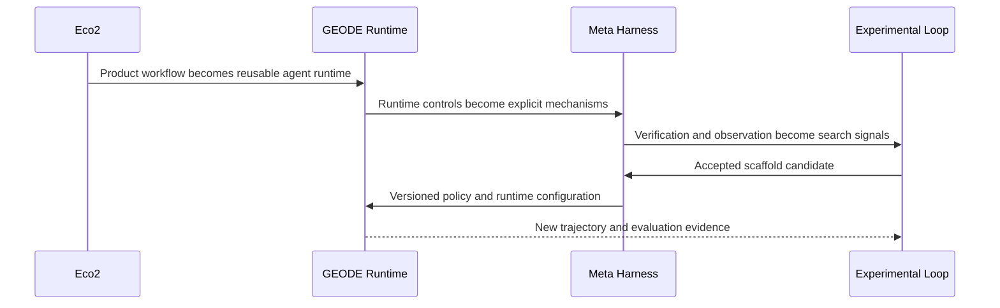
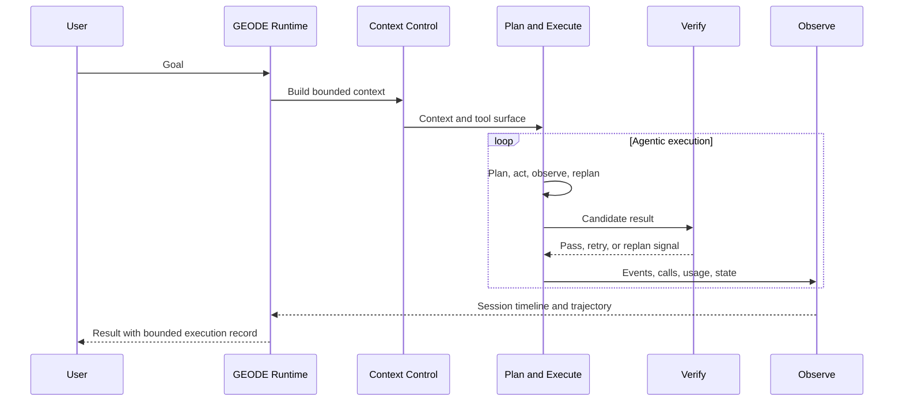
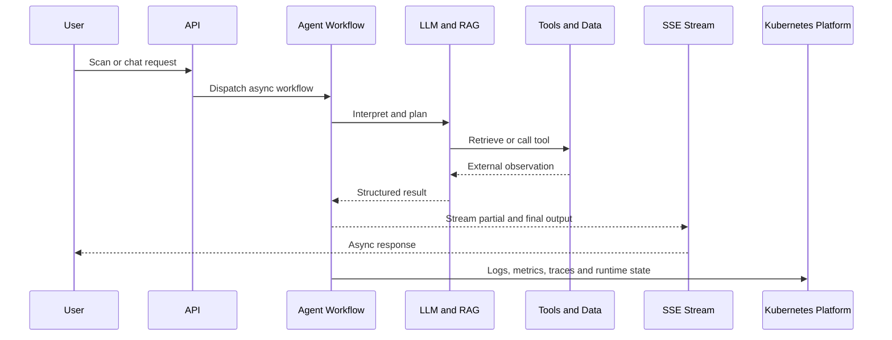
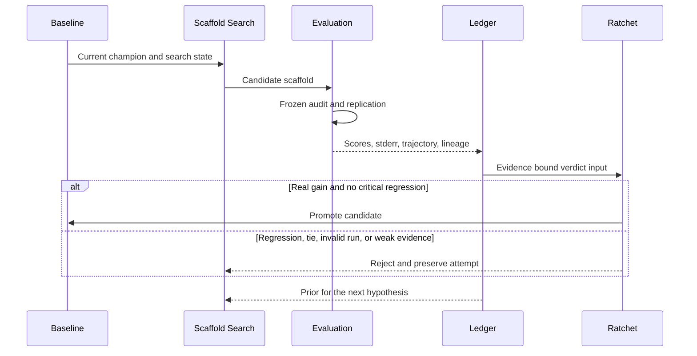
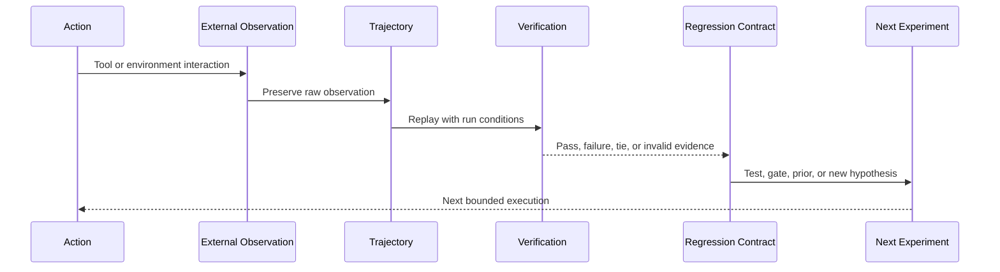

<strong>한국어</strong> · <a href="README_EN.md">English</a>

# 류지환

**실행을 검증 가능한 시스템으로 만들고, 그 결과를 다음 탐색의 입력으로 돌립니다.**

분산 스토리지와 백엔드, 클라우드 인프라를 거쳐 현재는 **자율 에이전트 런타임과 RSI(Recursive Self-Improvement) 방법론**을 다룹니다. 모델의 한 번의 성공보다 실행이 관찰 가능하고 재현 가능한지, 결과와 실패가 다음 실험의 재료로 남는지를 중요하게 봅니다.

개별 실행은 명확한 범위와 검증 조건 안에서 닫습니다. 반면 탐색 공간은 닫지 않습니다. 프롬프트뿐 아니라 문제 분해, 컨텍스트 구성, 도구 정책, Skill, 평가 방식, 에이전트 역할, 사람의 개입 지점까지 방법론 자체를 탐색 대상으로 둡니다.

[GEODE](https://mangowhoiscloud.github.io/geode/) · [기술 블로그](https://rooftopsnow.tistory.com) · [YouTube](https://www.youtube.com/@mango_fr) · [LinkedIn](https://linkedin.com/in/jihwan-ryu-b6b04a202)

`RSI / scaffold search` · `Autonomous agent runtime` · `Cloud / Kubernetes / IaC` · `Evidence / trajectories`

[작업 방식](#how-i-work) · [발전 과정](#evolution) · [대표 작업](#selected-work) · [검증과 기록](#evidence) · [개념](#concepts) · [이력](#experience) · [기록](#more)

## 작업 방식

**먼저 문제와 검증 범위를 좁힙니다.** 실패한 입력과 실제 호출 경로를 찾고, 무엇을 바꿀 수 있고 무엇을 보존해야 하는지 정한 뒤 가장 작은 재현 조건을 만듭니다.

**탐색에는 모델을 사용하고 판정에는 근거를 사용합니다.** 가설과 구현 후보를 만드는 데 AI를 적극적으로 활용하지만 수정의 성립 여부는 테스트, 원본 로그, 실행 기록과 외부 검증으로 판단합니다.

**결과를 다음 탐색의 데이터로 남깁니다.** 성공한 변경, 실패한 시도, 기각된 가설, 실행 trajectory와 평가 결과를 보존합니다. 원인은 회귀 테스트로, 반복할 조사 과정은 Skill과 절차로 정리하고 다음 후보와 탐색 전략의 입력으로 사용합니다.

**방법론 자체를 탐색 공간으로 둡니다.** 문제 분해, 컨텍스트, 도구 선택, 검증 순서, Skill, 에이전트 역할, 평가자 구성과 사람의 개입 지점까지 변경 후보가 됩니다. 하나의 방법을 정답으로 고정하기보다 같은 조건에서 다시 측정하고 결과에 따라 다음 탐색 방향을 정합니다.

**개별 실행은 유한하게 닫고 탐색 공간은 닫지 않습니다.** 코드 수정, CI, 병합, 설치와 배포는 각각 확인합니다. 실험이 동률이면 동률로 남기고 측정 범위를 넘어선 결론은 만들지 않습니다.

## 발전 과정

제 작업은 세 단계로 이어졌습니다. Eco²에서는 실제 서비스를 운영하며 **비동기 에이전트 워크플로우와 클라우드 런타임**을 만들었습니다. GEODE에서는 이를 범용 **자율 에이전트 런타임과 메타 하네스**로 분리했습니다. 현재 Experimental Loop에서는 실행 결과와 평가 기록을 다시 scaffold 탐색에 투입하는 **외부 개선 루프**를 실험합니다.

핵심 변화는 에이전트의 수를 늘린 것이 아니라 **실행을 제어하고 관찰하는 계층을 분리한 것**입니다. Eco²의 서비스 중심 오케스트레이션에서 GEODE의 Context Control, Plan and Execute, Verify, Observe로 제어 지점을 명시했고, 이후 Scaffold를 별도 탐색 대상으로 올렸습니다. GEODE의 현재 메타 하네스 카탈로그는 이 다섯 영역을 코드 경로와 실제 제어 지점에 연결합니다.

## 대표 작업

### GEODE

자연어로 맡긴 일을 계획하고 도구를 호출하는 **자율 에이전트 런타임**입니다. 장기 실행 메모리, 여러 모델 제공자 연결, 도구 실행, 권한 경계, 관찰과 평가 계층을 단독으로 구축해 왔습니다.

현재 배포 경계는 `core`, `evals`, `evolve`로 나뉩니다. `core`는 실제 작업을 실행하고, `evals`는 감사와 benchmark adapter를 통해 증거를 만들며, `evolve`는 그 증거를 이용해 실험적인 scaffold 후보를 탐색합니다. 런타임 내부에서는 Context Control, Plan and Execute, Verify, Observe가 확률적인 실행을 제한하고 수렴시키며, Scaffold 계층은 GEODE 자체를 만드는 규칙과 ratchet을 관리합니다.

이 구조에서 메타 하네스는 별도 제품이 아니라 **확률적 런타임을 제어하는 메커니즘의 집합**입니다. 컨텍스트 예산과 compaction, 동적 replan과 convergence detection, 검증 모드와 safety gate, event persistence와 session timeline 같은 제어가 서로 다른 계층에 배치됩니다.

[코드](https://github.com/mangowhoiscloud/geode) · [문서](https://mangowhoiscloud.github.io/geode/docs) · [메타 하네스 카탈로그](https://mangowhoiscloud.github.io/geode/docs/reference/meta-harness-catalog) · [실행과 평가 기록](https://github.com/mangowhoiscloud/geode-eval-artifacts) · [RSI 실험](https://mangowhoiscloud.github.io/geode/self-improving/)

### Eco²

재활용을 돕는 AI 서비스입니다. 5인 팀의 백엔드와 인프라 담당으로 시작해 이후 고도화와 운영을 단독으로 이어갔습니다. Vision LLM, RAG, 도구 호출, LangGraph 기반 멀티에이전트 처리와 비동기 SSE 응답을 실제 서비스와 Kubernetes 환경에 연결했습니다.

Eco²에서 중요한 경험은 모델 호출 자체보다 **모델을 서비스 런타임 안에서 운영하는 문제**였습니다. 비동기 작업, 스트리밍, 외부 데이터, 관측성, 인증 경로, 배포 자동화와 부하 검증이 함께 움직여야 했습니다. 이 경험이 이후 GEODE에서 런타임과 메타 하네스를 분리하는 출발점이 됐습니다.

**주요 기록:** **2025 AI 새싹톤 우수상(4th/181)**, Terraform, Ansible, ArgoCD 기반 **24노드 Kubernetes 운영**. 공개 부하 기록은 Scan API **1,000 VU에서 97.8%**, 별도의 ext-authz 인증 경로 **2,500 VU에서 1,477 RPS**입니다. VU는 부하 시험의 가상 사용자이며 실제 이용자 수가 아닙니다.

서비스 운영은 종료됐고 구조와 시행착오는 기술 포트폴리오로 남겼습니다.

[기술 포트폴리오](https://mangowhoiscloud.github.io/eco2/) · [프로젝트 저장소](https://github.com/eco2-team/backend)

### Experimental Loop

GEODE의 외부 루프는 모델 가중치를 학습하지 않습니다. 시스템 지침, 도구 정책, Skill, 작업 분해와 같은 **scaffold 후보**를 만들고, 고정된 측정 계층에서 평가한 뒤 승격하거나 기각합니다. 현재 공개 기록은 반복적인 자기개선이 입증됐다는 주장이 아니라, 후보를 만들고 검증하고 기각하는 실험 계약을 보여줍니다.

**래칫은 점수가 올랐다는 이유만으로 움직이지 않습니다.** 측정 장치와 후보 변경을 분리하고, critical dimension의 회귀를 veto하며, gain을 stderr margin과 비교합니다. baseline과 결과 ledger를 보존하고 실패한 후보도 지우지 않습니다. 승격은 다음 탐색의 baseline을 바꾸지만, 기각은 같은 baseline 위에서 다른 가설을 찾게 합니다. CI에서도 architecture, repo hygiene, prompt integrity, behavior와 coverage 같은 deterministic check를 별도의 ratchet으로 둡니다.

[두 루프](https://mangowhoiscloud.github.io/geode/docs/concepts/two-loops) · [실험 루프](https://mangowhoiscloud.github.io/geode/docs/self-improving/loop-overview) · [공개 평가 기록](https://github.com/mangowhoiscloud/geode-eval-artifacts)

### Compiler AX Lab

AI가 만든 코드를 **원인, 변경, 실행 증거를 연결한 검토 가능한 수정안**으로 넘기는 방법을 연구합니다. 공개 `furiosa-opt` SDK의 Rust 테스트와 Python 실행기를 다루는 독립 프로젝트이며 FuriosaAI 소속 또는 승인 프로젝트는 아닙니다.

2026-09-16 공개 CPU 기록에는 double-buffering 예제의 **46,080개 출력값 일치**, 워크스페이스의 **720개 일반 테스트와 55개 doctest 통과**가 남아 있습니다. 서로 다른 실행의 수치를 하나의 점수로 합치지 않습니다. A/B 파일럿의 대조 검사 결과는 동률이었고 CPU 값 검증은 NPU 정확성, 실행 중첩, 성능 검증을 대신하지 않습니다.

[코드와 검증 범위](https://github.com/mangowhoiscloud/compiler-ax-lab) · [회고 보고서](https://mangowhoiscloud.github.io/compiler-ax-lab/report.pdf)

### REODE @ pinxlab

GEODE에서 출발한 하네스를 코드 마이그레이션 제품으로 재설계했습니다. 규칙 기반 변경은 OpenRewrite에 맡기고 문맥 해석이 필요한 부분에 LLM을 사용했습니다. 같은 오류를 반복할 때는 수정 전에 조사하는 절차를 넣었습니다.

**2026.03 납품 기록:** Java 1.8→22, Spring 4→6 대상의 **5,523개 파일** 규모 서비스에서 **83/83 테스트와 프론트엔드, 백엔드 종단 검증**을 통과했습니다. 기록된 실행은 33개 자율 세션, 1,133라운드, 5시간 48분이며 해당 실행 중 사람 개입은 0회였습니다. 준비, 설계, 최종 검토까지 없었다는 의미는 아닙니다.

클라이언트 코드는 비공개입니다. [공개해 온 납품 요약과 수치의 범위](docs/PROFILE_NOTES.md#reode)를 별도로 기록했습니다.

## 검증, 재현, 기록

**검증은 결과의 모양이 아니라 계약을 확인하는 과정입니다.** 작업마다 바뀌면 안 되는 불변식과 측정 범위를 먼저 정합니다. 로컬 테스트, CI, 외부 평가, 설치와 배포 확인은 서로 대체하지 않습니다. 하나의 초록불을 전체 성공으로 확대하지 않고 각 검증이 무엇을 확인했는지 남깁니다.

**재현은 같은 숫자를 한 번 더 얻는 것보다 조건을 고정하는 데서 시작합니다.** 모델 경로, harness revision, task set, effort, timeout, seed, attempt lineage처럼 결과를 바꿀 수 있는 조건을 실행 기록에 묶습니다. 비교 실험에서는 baseline과 candidate가 같은 측정 조건을 공유하도록 하고, quota나 오류로 오염된 실행은 정상 결과에 섞지 않습니다.

**trajectory는 디버깅 로그가 아니라 연구 데이터입니다.** 요청, 도구 호출, 외부 observation, 실패와 retry, 최종 verdict가 이어지는 실행 궤적을 보존합니다. 성공 trajectory는 어떤 제어가 작동했는지 보여주고, 실패 trajectory는 다음 회귀 테스트와 mutation hypothesis를 만드는 재료가 됩니다. 요약보다 원본 기록을 우선하고, 공개할 때는 privacy review와 provenance를 함께 관리합니다.

**래칫은 기억을 자동화하는 방식입니다.** 한 번 발견한 실패는 회귀 테스트나 deterministic check로 고정하고, 승격된 baseline은 다음 비교의 기준으로 사용합니다. 기준을 통과하지 못했을 때 threshold를 낮추기보다 원인을 찾고, 기존 테스트를 삭제해야 한다면 남는 불변식이 무엇인지 별도로 검토합니다. 이렇게 실행 기록, 테스트, CI