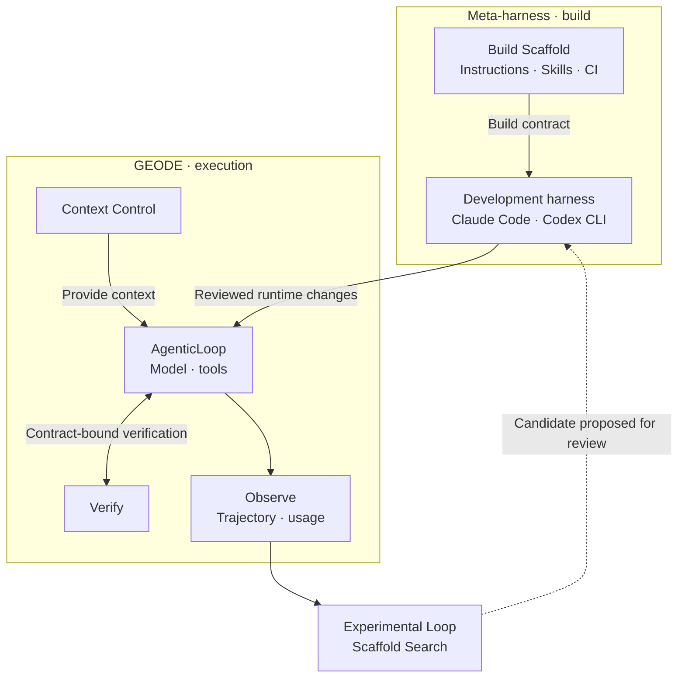
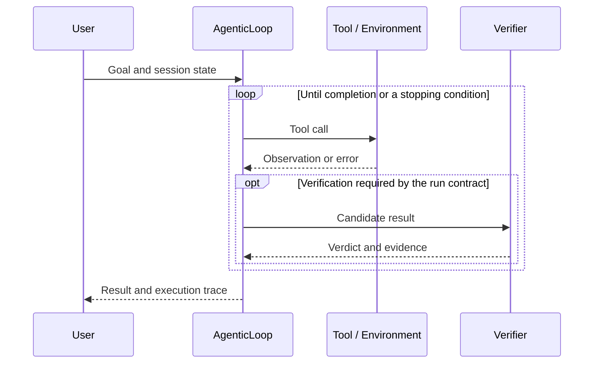
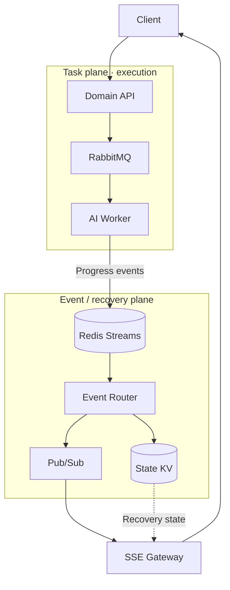
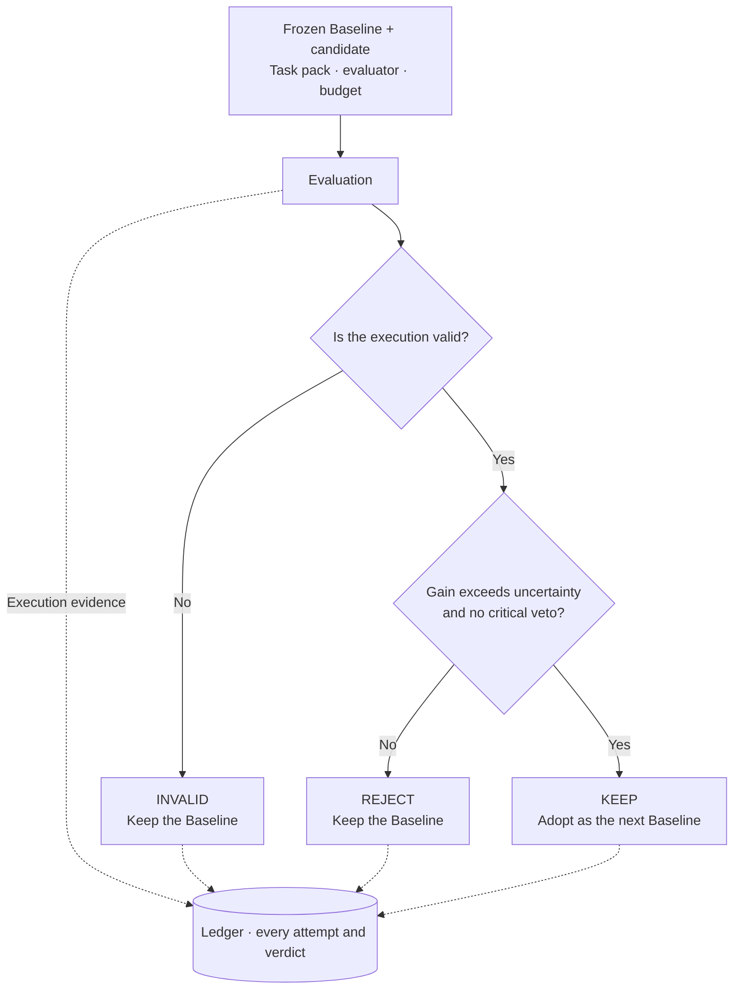

<a href="README.md">한국어</a> · <strong>English</strong>

# Jihwan Ryu

**I build agent runtimes and verify the effects of changing them.**

My background spans distributed storage, backend engineering, and cloud infrastructure. I now develop autonomous agent runtimes and evaluation systems: tracing failed tool calls, then testing whether a code or scaffold change improves the result under the same conditions.

[GEODE](https://mangowhoiscloud.github.io/geode/) · [Blog](https://rooftopsnow.tistory.com) · [YouTube](https://www.youtube.com/@mango_fr) · [LinkedIn](https://linkedin.com/in/jihwan-ryu-b6b04a202)

[Selected work](#selected-work) · [Evolution](#evolution) · [How I work](#how-i-work) · [Verification and records](#evidence) · [Experience](#experience)

## Selected work

### GEODE · Separating execution from the system that builds it

An **autonomous agent runtime** that manages long-running memory, model connections, tools, permissions, and verification. `core` owns execution, `evals` measurement, and `evolve` experimental scaffold search.

The build system is a separate concern. A **meta-harness builds, verifies, and revises the harness's code and scaffold**. Claude Code or Codex CLI reads `AGENTS.md`, `CLAUDE.md`, Skills, and CI contracts to change GEODE. It is not another controller sitting above a running agent.

Execution records inform subsequent changes. **Candidate adoption is separate from PR merge and release approval**; deployment authority remains with the operator.

What repeats within a run?

This is the part where request and response order matters. The runtime manages context assembly and compaction; verification follows the contract for that run.

A model's completion statement, a verifier verdict, and a termination reason are different records. Separating context, execution, verification, and observation makes it possible to investigate which change affected the outcome.

[Code](https://github.com/mangowhoiscloud/geode) · [Docs](https://mangowhoiscloud.github.io/geode/docs) · [Meta-harness catalog](https://mangowhoiscloud.github.io/geode/docs/reference/meta-harness-catalog) · [Evaluation records](https://github.com/mangowhoiscloud/geode-eval-artifacts)

### Eco² · Let the work outlive the connection

I built and operated the backend and Kubernetes infrastructure for an AI recycling service. Long-running AI workers and the SSE connections delivering progress have separate lifetimes. The project received the **2025 AI SeSACTHON Excellence Award (4th/181)**. The service has closed.

| Workload | Execution model | Design focus |
| --- | --- | --- |
| Chat | Intent routing, selected domain nodes running in parallel, then a join | Choose the required work and combine its results into an answer. |
| Scan | Celery chain: Vision → Rule/RAG → Answer → Reward | Separate long-running execution from progress delivery. |
| Image generation | Separate graph branch | Use a distinct path from the other conversational work. |

Task plane and event/recovery plane

Event Router owns ACK, reclaim, and deduplication. Streams and State provide replay and recovery records. SSE Gateway owns client connections. This is a topology and data-flow view, not a single sequence traversed by every request.

| Operational responsibility | Implementation |
| --- | --- |
| Infrastructure and service traffic | Terraform, Ansible, Kubernetes, Istio |
| Desired deployment state | Git manifests and ArgoCD sync waves |
| Replica adjustment during execution | KEDA, with replica ownership separated from ArgoCD |
| Before/after observations | Prometheus/Grafana, EFK, Jaeger/OTEL, LangSmith |

A human and coding agent propose deployment changes, and CI checks them. ArgoCD applies approved Git state. The same workload is measured again before a human decides to keep, revise, or revert. This was not a runtime rewriting its own source.

Chat's production wiring mostly uses a structured/function call to extract arguments, then executes an application command. That differs from multiple unconstrained ReAct agents.

The public project report gives a **Scan success rate of 97.8% at 1,000 VU**. A separate ext-authz load record gives **1,477 RPS at 2,500 VU**. These are different workloads, not real-user counts or one combined performance score. A mismatch between completion counts and the reported success-rate denominator is documented in the [source notes](docs/PROFILE_NOTES.md#eco2).

[Portfolio](https://mangowhoiscloud.github.io/eco2/) · [Project repository](https://github.com/eco2-team/backend)

### Experimental Loop · A higher score is not enough to adopt a change

The search space is **scaffolding around the model**, including instructions, tool policy, Skills, and task decomposition, not model weights. Baseline and candidate share tasks, evaluator, and budget. A Ledger retains every attempt and verdict.

When the Baseline changes: KEEP / REJECT / INVALID

The Ratchet applies these conditions. A score increase alone, a tie, or an incomplete run does not change the baseline. `KEEP` is an experiment verdict, not deployment approval or evidence of sustained self-improvement.

[Two loops](https://mangowhoiscloud.github.io/geode/docs/concepts/two-loops) · [Experiment design](https://mangowhoiscloud.github.io/geode/docs/self-improving/loop-overview) · [RSI experiment records](https://mangowhoiscloud.github.io/geode/self-improving/)

### REODE @ pinxlab · Code migration

A GEODE-derived code-migration harness combining OpenRewrite with LLM-based contextual repair. A **5,523-file** Java 1.8→22 and Spring 4→6 delivery passed **83/83 tests** plus frontend/backend end-to-end verification.

The March 2026 delivery record covers 33 autonomous sessions, 1,133 rounds, and 5h 48m. Zero human intervention applies to that recorded run, not project preparation or final review. [Delivery scope](docs/PROFILE_NOTES.md#reode)

## Evolution

Each project changed what needed to be verified.

| Work | Problem | Design carried forward |
| --- | --- | --- |
| Eco² | AI work, connections, and deployments have different lifetimes. | Asynchronous execution, event recovery, and separate operational owners |
| GEODE | Service-specific implementations need a reusable runtime. | Separate agent execution from the system that builds the harness |
| SIL | Scaffold changes need safety measurements. | External audits, critical-dimension floors, and failure records |
| Crucible | Passing rows from different revisions do not validate the final candidate. | Freeze candidate, evaluator, and task pack before comparison and promotion |

SIL → Crucible: a failure that changed the experiment design

SIL used Petri-style multidimensional safety audits to evaluate scaffold candidates, connecting generation, audit, adoption, and revert with transcript and cost records.

The July 2026 Crucible campaign exposed a problem: passing rows from different candidate revisions had been combined into an apparent target-set closure. That did not prove the final candidate passed all earlier rows. G4 rows inspected and used for repair could no longer count as held-out evidence.

The current contract freezes candidate commit, evaluator/harness identity, content-bound task pack, paired comparison rule, budget, and vetoes before execution. Failed training rows may inform the next candidate; an opened sealed row cannot be reused for the same promotion claim.

[Crucible frozen experiment kernel](https://github.com/mangowhoiscloud/geode/blob/main/docs/architecture/crucible-kernel.md) · [Historical Self-Improving Roadmap](https://github.com/mangowhoiscloud/geode/blob/main/docs/plans/2026-05-22-self-improving-roadmap.md)

**RSI (Recursive Self-Improvement) is a research direction, not a claimed achievement.** Current work builds an external system to execute, measure, and judge scaffold changes. The next evidence needed is whether adopted changes remain effective on other task families and fresh sealed evidence.

## How I work

- **Make hypotheses falsifiable.** Specify the task family, candidate change, metric, and veto before execution.
- **Build the smallest reproduction.** Find the failing input and call path, then define what may change and what must remain fixed.
- **Leave the investigation in the implementation.** Confirmed causes become regression tests; repeatable investigations become Skills. Investigate a failed check before lowering its threshold.

Task decomposition, context, tool choice, verification order, and evaluator composition can also become candidate variables. Individual runs have bounded budgets; the methodology is not treated as a fixed answer.

## Verification, reproduction, and records

A Trajectory is research data. I connect **who produces a record, who reads it, and which decision it supports**.

| Producer | Record | Reader and decision |
| --- | --- | --- |
| Runtime | Requests, tool calls/results, observations, retries, termination reason | An engineer identifies the failure and reproduction conditions. |
| Evaluator | Run spec, revision, task ID, verifier result | Comparison analysis establishes valid samples and scores. |
| Promotion gate | Ledger, lineage, KEEP / REJECT / INVALID | The experiment system selects the next Baseline or retains the current one. |
| Operator | CI, installation, deployment checks, and approval | A human authorizes code merge and deployment. |

Original records remain separate from derived summaries, with provenance and privacy checked before publication. Local tests, external evaluations, CI, and deployment checks do not substitute for one another.

Harbor rollout: repairing the measurement apparatus first

Comparing actual rollout against integration drafts exposed cache-accounting inclusion errors, cleanup paths that could mask the first execution error, and missing raw samples from performance failures. Changes preserved the first error and original samples, and made usage producers and denominators explicit.

A separate preregistered Terminal-Bench 2.1 smoke on Harbor 0.22.0 recorded **reward 1/1, verifier 6/6, errors/retries 0/0, tool calls/results 2/2, and 0 orphans**. This is a 1/89-task, k=1 account-scoped integration check, not a suite-level result or a Reflexion-effect estimate. It does not establish complete whole-runtime usage.

[Harbor gap closure PR #3311](https://github.com/mangowhoiscloud/geode/pull/3311) · [Terminal-Bench Astra smoke](https://github.com/mangowhoiscloud/geode/blob/main/docs/eval/2026-09-05-terminalbench-astra-openssl-smoke.md)

Terms: agent · harness · meta-harness · RSI

- **Agent:** uses tools to make progress on a task.
- **Harness:** manages tools, memory, permissions, failure handling, and verification.
- **Meta-harness:** builds, verifies, and revises the harness's code and scaffold.
- **RSI:** a research direction in which earlier evidence informs later changes and experiments. Adoption and repeated improvement require separate evidence.

## Experience

| Period | Experience |
| --- | --- |
| 2026.02–present | **GEODE** · Solo development · SIL 2026.05–06 · Crucible 2026.07–present |
| 2026.03–05 | **pinxlab** · Freelance · REODE, Kiki, Cotton |
| 2025.10–2026.02 | **Eco²** · Backend/infrastructure to solo development and operation · 2025 AI SeSACTHON Excellence Award |
| 2024.12–2025.08 | **Rakuten Symphony Korea** · Jr. Cloud Engineer, Storage Developer · PB-scale distributed storage |
| 2024.07–11 | **Kakao Tech Bootcamp** · Backend, DevOps, LLM |
| 2017.03–2023.08 | **Pusan National University** · B.S., Computer Science & Engineering |

Rakuten work included **Rakuten Cloud Native Platform, Storage Server v5.5.0 · Rakuten Storage v1.0.0**.

Other work

- **Kiki @ pinxlab · 2026.04–05:** Slack-directed multi-agent analysis, implementation, and review with a two-stage gate.
- **Cotton @ pinxlab · 2026.05:** RPG translation SaaS modeling dialogue as a graph.
- **[Crumb & Crumb Studio](https://github.com/mangowhoiscloud/crumb) · 2026.05:** replayable CLI-agent game-studio experiment.
- **[DREAM](https://github.com/KakaoTech-Hackathon-Dream) · 2024.09:** generative AI narrative and image service.
- **[Aimo](https://github.com/KTB16Team) · 2024:** LLM-based conflict-mediation backend.

## Notes

I document implementation and experiments on my [blog](https://rooftopsnow.tistory.com) and [YouTube](https://www.youtube.com/@mango_fr). Previous GitHub account: [@mng990](https://github.com/mng990)

Content reviewed: 2026-09-18 · <a href="docs/PROFILE_NOTES.md">Sources, scope, and maintenance notes</a>

