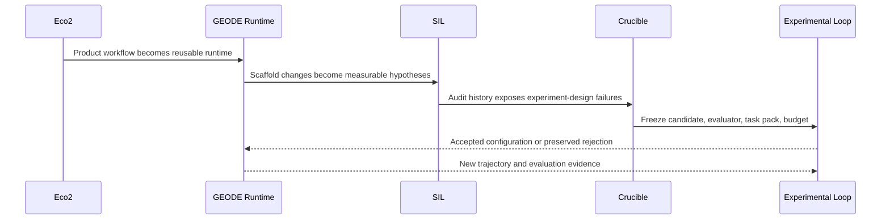
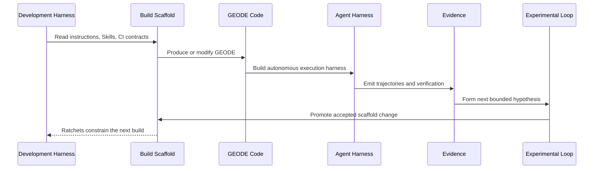
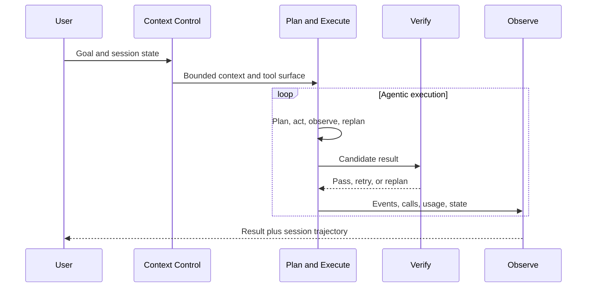
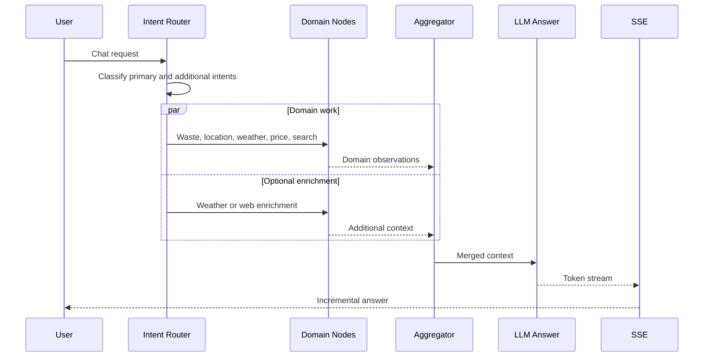
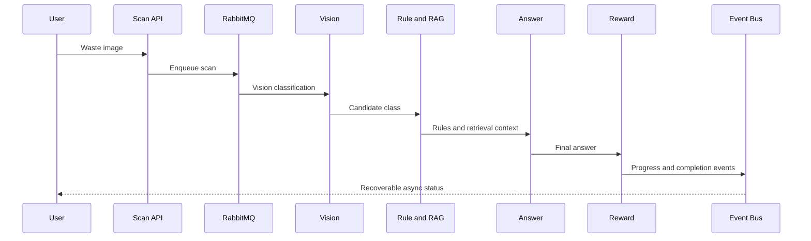
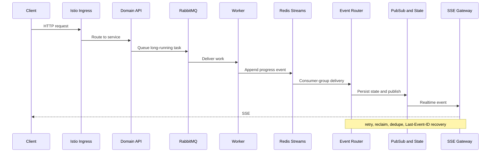
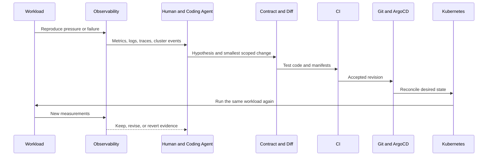
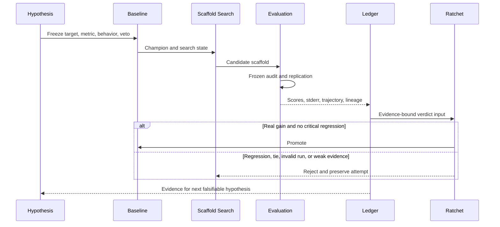
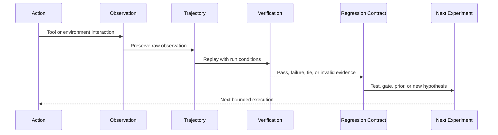

<p align="right"><a href="README.md">한국어</a> · <strong>English</strong></p>

# Jihwan Ryu

**I build verifiable systems, then feed their results back into the next search.**

My background spans distributed storage, backend engineering, and cloud infrastructure. Today I work on **autonomous agent runtimes and RSI (Recursive Self-Improvement) methodology**. I care about observable, reproducible execution and about preserving results and failures as material for the next experiment.

[GEODE](https://mangowhoiscloud.github.io/geode/) · [Technical blog](https://rooftopsnow.tistory.com) · [YouTube](https://www.youtube.com/@mango_fr) · [LinkedIn](https://linkedin.com/in/jihwan-ryu-b6b04a202)

[](https://github.com/mangowhoiscloud/geode/releases/latest)

`RSI / scaffold search` · `Autonomous agent runtime` · `Cloud / Kubernetes / IaC` · `Evidence / trajectories`

[How I work](#how-i-work) · [Evolution](#evolution) · [Selected work](#selected-work) · [Verification and records](#evidence) · [Concepts](#concepts) · [Experience](#experience) · [Notes](#more)

<a id="how-i-work"></a>
## How I work

**Turn an idea into something that can be wrong.** “This will improve the agent” is not an experiment. I first define the population or task family, the measurable threshold, and the behavior or outcome to observe. It is the same discipline as writing a product hypothesis in the form `X% of Y will do Z`. For agent research, I translate it into `on which task family will which candidate pass which frozen metric and veto`. An expectation that cannot be falsified does not authorize promotion.

**Bound the problem first.** I find the failing input and actual call path, define what may change, then construct the smallest reproducible condition.

**Use models for exploration and evidence for decisions.** AI helps form hypotheses and implementation candidates. Tests, original logs, execution records, and external verification decide whether a change holds.

**Preserve results as data for the next search.** Successful changes, failed attempts, rejected hypotheses, trajectories, and evaluation results remain available. Causes become regression tests; repeatable investigations become Skills or procedures.

**Treat methodology itself as a search space.** Task decomposition, context, tool selection, verification order, Skills, agent roles, evaluator composition, and human intervention can all become candidate variables. Individual runs are bounded; the search space stays open.

<a id="evolution"></a>
## Evolution

Eco² was a production service where I built an **asynchronous agent workflow and cloud runtime**. GEODE separated those lessons into a reusable **autonomous agent runtime**, then treated the build layer as a **meta-harness**. Here meta-harness does not mean a controller sitting above the runtime. It means the **system that builds the harness itself**, including the development harness, its instruction scaffold, Skills, verification, and ratchets. SIL made scaffold changes measurable through external safety audits. Crucible then turned the lessons from those experiments into a **frozen experiment contract** that binds candidate, evaluator, task pack, budget, and promotion authority before execution. The current Experimental Loop feeds execution and evaluation evidence back into an outer scaffold-search loop.



The important progression is not the number of agents. It is the ability to **make a hypothesis falsifiable and let failure change the design of the next experiment**.

### From SIL to Crucible

SIL used Petri-style multidimensional safety audits and critical-dimension floors to evaluate scaffold candidates. It established an end-to-end mutate, audit, promote or revert loop with transcripts and cost records.

The July 2026 Crucible campaign produced a more valuable counterexample. Rows that passed under different candidate revisions had been stitched into an apparent target-set closure even though the final candidate had not been rerun across every earlier row. Once G4 rows were inspected, repaired, and rerun, they became training counterexamples rather than held-out evidence. More than a thousand gate artifacts and tens of millions of tokens still did not produce a reproducible champion because candidate, evaluator, task set, and cost window were not frozen together.

The current Crucible kernel therefore freezes one candidate commit, evaluator and harness identity, content-bound task pack, paired comparison rule, budget, and vetoes before execution. Outcomes are `KEEP`, `REJECT`, or `INVALID`; infrastructure failure is not converted into a low task score. A failed train row may inform the next candidate, while an opened sealed row cannot be reused for the same promotion claim.

[Crucible frozen experiment kernel](https://github.com/mangowhoiscloud/geode/blob/main/docs/architecture/crucible-kernel.md) · [Self-Improving Roadmap](https://github.com/mangowhoiscloud/geode/blob/main/docs/plans/2026-05-22-self-improving-roadmap.md)

### Where this sits on the path toward RSI

RSI is a direction, not a claimed current capability. The historical 2026-05-22 Self-Improving Roadmap decomposed the work as `outer loop → inner memory/recall → cognitive loop`; the document now explicitly marks itself as provenance rather than an active execution ledger. Relative to that roadmap, the current work has reached the point where the **outer loop is an executable experimental system and measurement authority is separated from promotion authority**.

```text
service runtime
  -> autonomous agent runtime
  -> autonomous agent harness\n  -> meta-harness: harness-building system
  -> SIL: safety-scaffold audit loop
  -> Crucible: frozen experiment + promotion ratchet   [current]
  -> repeated cross-task evidence and retained improvements
  -> broader recursive improvement across methodology [direction]
```

So the claim is not “RSI is implemented.” It is **building toward RSI by first constructing the conditions under which repeated improvement could be demonstrated**. The next important evidence is not one KEEP verdict, but whether a retained change continues to hold across new task families and fresh sealed evidence.

<a id="selected-work"></a>
## Selected work

### GEODE

An **autonomous agent runtime** with long-running memory, multi-provider routing, tool execution, permission boundaries, observability, and evaluation. The distribution separates `core` for execution, `evals` for evidence production, and `evolve` for experimental scaffold search.

In GEODE, the **agent harness** and the **meta-harness** are different scopes. Context Control, Plan and Execute, Verify, and Observe belong to the shipped harness that converges an agent run. The meta-harness is the **apparatus that builds that harness**. Development harnesses such as Claude Code or Codex CLI read `CLAUDE.md`, `AGENTS.md`, development Skills, CI, and ratchets to produce and modify GEODE code and its runtime scaffold.

`Scaffold` therefore describes the build-side contract rather than another runtime control category. Patterns validated in the runtime can move into the build line; failures found while building become tests, instructions, or CI ratchets. When the self-improving outer loop mutates and audits the runtime scaffold and promotes or reverts a candidate, that relationship begins to close recursively. Operator gates still retain PR merge and release authority.



Here, meta means that **the harness itself is the object being built**, not merely that another layer observes it.



Context budgets and compaction, dynamic replanning and convergence detection, verification modes and safety gates, event persistence, and session timelines live at different layers so each can be measured and changed independently.

[Code](https://github.com/mangowhoiscloud/geode) · [Docs](https://mangowhoiscloud.github.io/geode/docs) · [Meta-harness catalog](https://mangowhoiscloud.github.io/geode/docs/reference/meta-harness-catalog) · [Execution and evaluation records](https://github.com/mangowhoiscloud/geode-eval-artifacts) · [RSI experiments](https://mangowhoiscloud.github.io/geode/self-improving/)

### Eco²

An AI recycling service. Eco² is more accurately described as **purpose-specific execution graphs, the cluster that supported them, and an external improvement loop that rebuilt both from observed failures**, rather than as one “agent.” In the verified code snapshot, Chat classifies 10 intents and fans out the required nodes in parallel, while Scan uses a Celery chain of Vision → Rule/RAG → Answer → Reward. Image generation is a separate branch.

#### Execution graphs by purpose



**Chat is a routing and parallel-join problem.** I do not describe the production wiring as a set of unconstrained ReAct subagents. Most domain nodes use a structured/function call to extract arguments and then execute a deterministic application command.



**Scan is an asynchronous job-pipeline problem.** RabbitMQ/Celery owns long-running work, while progress delivery is separated into Redis Streams → Event Router → Pub/Sub/State → SSE Gateway. Chat decides which reasoning path should answer; Scan is concerned with completing long-running work and exposing recoverable state.

#### Cluster and deployment structure

The verified fact sheet records **20 EC2 nodes and 19 microservices (9 APIs + 9 Workers + ext-authz)**. An older README listed 24 nodes, so the profile uses the code-verified 20-EC2 figure.



The important property is **ownership separation**, not component count. Istio owns edge/service traffic, RabbitMQ task orchestration, Event Router ACK/reclaim, Streams/State replay and recovery, and SSE Gateway client connections. KEDA adjusts replicas from workload signals such as queue depth, pending work, and connections, while ArgoCD avoids taking ownership of the autoscaler's replica field.

Deployment was layered as well. Terraform and Ansible established the base, Kubernetes manifests in Git formed desired state, and ArgoCD sync waves ordered dependencies such as Redis → RabbitMQ → KEDA → Gateway → Router. Prometheus/Grafana, EFK, Jaeger/OTEL, and LangSmith exposed different observation surfaces.

#### Where the improvement loop actually closed

The useful story in the Eco² portfolio is not the final architecture. It is **how a failure changed the next architecture**. This was not RSI or a production runtime rewriting its own source. It was an external engineering loop in which a human and coding agent read evidence, made a small change, and reran the same workload.



The pattern appears repeatedly.

**The first loop was SSE connection amplification.** At 50 VU, active SSE connections drove RabbitMQ connection growth and scan-api memory pressure until readiness failures surfaced as 503s. The hypothesis was not merely “replace the broker”; it was that **task lifetime and progress-delivery lifetime were coupled**. RabbitMQ remained the task queue while progress moved to Redis Streams and a separate SSE Gateway. Later observations added ACK-on-success, reclaim, dedupe, Last-Event-ID recovery, Pub/Sub master handling, and four-way sharding. One redesign produced the next failure signal and therefore the next contract.

**The second loop was scaling and guardrail failure.** After connection pressure was reduced, repeated VU sweeps exposed queue wait, worker state, and probe restarts as the next bottlenecks. Rather than only raising CPU or memory, the system moved toward workload-specific KEDA signals and bounded min/max replicas. A health probe that was supposed to protect the service could restart I/O-bound Celery workers and lose in-flight work. That made **the guardrail itself an object of verification**.

**The third loop was evaluation.** Chat quality was split into a deterministic Code Grader, a BARS-based LLM Judge, and a Calibration Monitor that watches judge drift, rather than treating one LLM score as ground truth. The calibration seed and runtime wiring still had limitations, so I do not call it a finished production quality loop. The important lesson was that **the measurement apparatus also needs measurement**, which later appears in GEODE's evaluator separation and Crucible's frozen contracts.

The Eco² precursor to a meta-harness can therefore be summarized as:

`failure signal → reproducible workload → hypothesis → scoped code/manifest diff → CI → Git/ArgoCD → same workload → human verdict → next contract`

Observability had no promotion authority. It was the **feedback surface that produced the next build change**, while Git history and CI acted as the ratchet. GEODE makes this formerly loose outer loop explicit through a development scaffold, trajectories, revision-bound evaluation, ratchets, and promotion contracts.

**Recorded milestone:** **2025 AI SeSACTHON Excellence Award (4th/181)**. The preserved Scan k6 sweep ends with **1,469/1,518 completions, 97.8% at 1,000 VU**, but the same day also contains **92.5% → 96.6% → 0% → 0% → 0% → 97.8%**. A separate ext-authz load record reports **1,477 RPS at 2,500 VU** and is not combined with the Scan result. I read these as **a preserved regression-and-remeasurement record**, not a monotonic performance curve. The service has closed.

[Technical portfolio](https://mangowhoiscloud.github.io/eco2/) · [Project repository](https://github.com/eco2-team/backend)

### Experimental Loop

GEODE's outer loop searches **scaffolding around the model**, not model weights. System instructions, tool policy, Skills, and task decomposition can become candidates. A frozen measurement layer evaluates them before promotion or rejection.



**The ratchet does not move because a single score increased.** Candidate edits and measurement apparatus stay separate. Critical-dimension regressions can veto promotion, gain is compared against uncertainty, and baseline plus result ledgers are retained.

[Two loops](https://mangowhoiscloud.github.io/geode/docs/concepts/two-loops) · [Experiment loop](https://mangowhoiscloud.github.io/geode/docs/self-improving/loop-overview) · [Public evaluation records](https://github.com/mangowhoiscloud/geode-eval-artifacts)

### What Harbor rollout changed

Integrating an external benchmark follows the same principle. “Harbor runs” is not the end of the hypothesis. The important questions are **which failure is preserved, which denominator is used, and which evidence receives authority**.

During the v1.0.28 rollout and gap-closure work, comparing actual execution with integration drafts exposed several measurement defects. Cache read/write inclusion and cost presentation were not consistently propagated to the UI. A secondary Harbor cleanup/export error could mask the original execution failure. Raw samples for performance failures were insufficiently preserved. Documentation had drifted from the latest verifier contracts, and obsolete integration drafts had to be separated from current code. Whole-runtime usage and Reflexion effectiveness remained explicitly unobserved rather than being marked complete.

The fix was not framed as “higher success.” It **repaired the measurement apparatus**: preserve the first execution error, define accounting owners and denominators, retain raw samples and diagnostics, and avoid reapplying superseded changes. A later preregistered Terminal-Bench 2.1 smoke froze its run spec before execution and recorded Harbor 0.22.0 reward **1/1**, verifier **6/6**, Harbor errors/retries **0/0**, and tool calls/results **2/2 with 0 orphans**. That remains a 1/89-task, k=1 account-scoped smoke, not a suite-level performance claim.

[Harbor gap closure PR #3311](https://github.com/mangowhoiscloud/geode/pull/3311) · [Terminal-Bench Astra smoke](https://github.com/mangowhoiscloud/geode/blob/main/docs/eval/2026-09-05-terminalbench-astra-openssl-smoke.md)

### REODE @ pinxlab

A GEODE-derived code-migration harness combining OpenRewrite with LLM-based contextual repair. A **5,523-file** Java 1.8→22 and Spring 4→6 delivery passed **83/83 tests** plus frontend/backend end-to-end verification. The recorded run covered 33 autonomous sessions, 1,133 rounds, and 5h 48m with zero human intervention during that run, not zero preparation or review.

[Delivery scope](docs/PROFILE_NOTES.md#reode)

<a id="evidence"></a>
## Verification, reproduction, and records

**Verification checks the contract.** Local tests, CI, external evaluation, installation, and deployment checks do not substitute for one another. Each record states what it actually established.

**Reproduction starts by freezing conditions.** Model route, harness revision, task set, effort, timeout, seed, and attempt lineage stay attached to a run when they can affect the result. Baseline and candidate share measurement conditions; errored or quota-contaminated runs stay separate.

**A trajectory is research data.** Requests, tool calls, external observations, failures, retries, and final verdicts form an execution trace. Successful trajectories show which controls were active. Failed trajectories become material for regression tests and mutation hypotheses. Original records take precedence over summaries, with provenance and privacy review for published artifacts.



**A ratchet automates memory.** An understood failure becomes a regression test or deterministic check. A promoted baseline becomes the next reference. When a check fails, the first response is investigation, not relaxing the threshold.

<a id="concepts"></a>
## Concepts

An **agent** uses tools to make progress. A **harness** manages tools, memory, permissions, failure handling, and verification. A **meta-harness** treats the harness itself as the artifact to build, verify, and revise. In GEODE, development harnesses, instruction scaffolds, Skills, and CI ratchets form that production line, with runtime evidence feeding the next build change. **RSI (Recursive Self-Improvement)** here means feeding evidence from earlier executions back into later changes and experiments while keeping adoption and repeated improvement as separate claims.

<details>
<summary><strong>Other work</strong></summary>

**Kiki @ pinxlab · 2026.04–05:** Slack-directed multi-agent analysis, implementation, and review with a two-stage gate.  
**Cotton @ pinxlab · 2026.05:** RPG translation SaaS modeling dialogue as a graph.  
**[Crumb & Crumb Studio](https://github.com/mangowhoiscloud/crumb) · 2026.05:** replayable CLI-agent game-studio experiment.  
**[DREAM](https://github.com/KakaoTech-Hackathon-Dream) · 2024.09:** generative AI narrative and image service.  
**[Aimo](https://github.com/KTB16Team) · 2024:** LLM-based conflict-mediation backend.

</details>

<a id="experience"></a>
## Experience

| Period | Experience |
| --- | --- |
| 2026.02–present | **GEODE** · Solo development · SIL 2026.05–06 · Crucible 2026.07–present |
| 2026.03–05 | **pinxlab** · Freelance · REODE, Kiki, Cotton |
| 2025.10–2026.02 | **Eco²** · Backend/infrastructure to solo development and operation · 2025 AI SeSACTHON Excellence Award |
| 2024.12–2025.08 | **Rakuten Symphony Korea** · Jr. Cloud Engineer, Storage Developer · PB-scale distributed storage |
| 2024.07–11 | **Kakao Tech Bootcamp** · Backend, DevOps, LLM |
| 2017.03–2023.08 | **Pusan National University** · B.S., Computer Science & Engineering |

Rakuten work included **Rakuten Cloud Native Platform, Storage Server v5.5.0 · Rakuten Storage v1.0.0**.

<a id="more"></a>
## Notes

I document implementation and experimental findings on my [blog](https://rooftopsnow.tistory.com) and [YouTube](https://www.youtube.com/@mango_fr). [LinkedIn](https://linkedin.com/in/jihwan-ryu-b6b04a202) · Previous GitHub account: [@mng990](https://github.com/mng990)

<sub>Content reviewed: 2026-09-18 · <a href="docs/PROFILE_NOTES.md">Sources, scope, and maintenance notes</a></sub>

[](https://github.com/mangowhoiscloud/mangowhoiscloud/actions/workflows/profile.yml)
