
<a href="README.md">한국어</a> · <strong>English</strong>

# Jihwan Ryu

**I build agent runtimes and verify the effects of changing them.**

My background spans distributed storage, backend engineering, and cloud infrastructure. I now develop autonomous agent runtimes and evaluation systems: tracing failed tool calls, then testing whether a code or scaffold change improves the result under the same conditions.

[GEODE](https://mangowhoiscloud.github.io/geode/) · [Blog](https://rooftopsnow.tistory.com) · [YouTube](https://www.youtube.com/@mango_fr) · [LinkedIn](https://linkedin.com/in/jihwan-ryu-b6b04a202)

[Selected work](#selected-work) · [Evolution](#evolution) · [How I work](#how-i-work) · [Verification and records](#evidence) · [Experience](#experience)

## Selected work

### GEODE · Separating execution from the system that builds it

An **autonomous agent runtime** that manages long-running memory, model connections, tools, permissions, and verification. `core` owns execution, `evals` measurement, and `evolve` experimental scaffold search.

The build system is a separate concern. A **meta-harness builds, verifies, and revises the harness's code and scaffold**. Claude Code or Codex CLI reads `AGENTS.md`, `CLAUDE.md`, Skills, and CI contracts to change GEODE. It is not another controller sitting above a running agent.

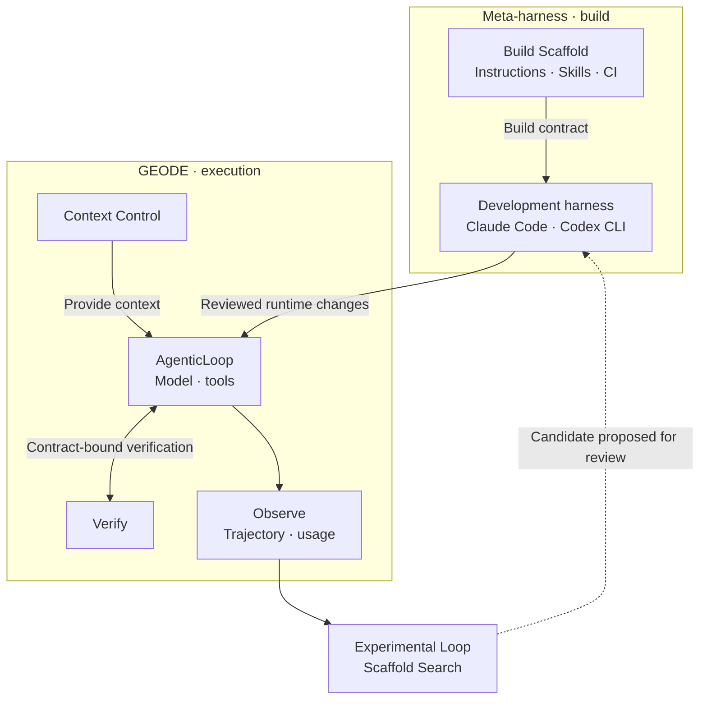

Execution records inform subsequent changes. **Candidate adoption is separate from PR merge and release approval**; deployment authority remains with the operator.

Meta-harness · Building changes and blocking regressions with a CI ratchet

The developer sets scope and acceptance criteria. The coding agent reads the implementation and failure evidence, then works in an isolated worktree. **A fix includes a check that can catch the failure again.** Local checks and PR CI inspect the same change revision; failures return to diagnosis and correction.

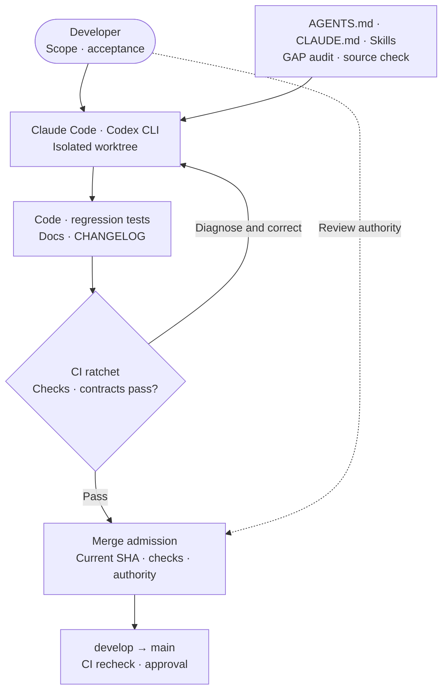

| CI invariant | Executable checks | Regression it addresses |
| --- | --- | --- |
| Behavior, types, and dependencies | Ruff, mypy, pytest, import contracts | Behavioral failures, type mismatches, and dependency-boundary violations. |
| Baselines and policy | Legacy import ratchet, architecture exception debt, performance baseline | Newly introduced legacy imports, policy violations, and performance-baseline failures. |
| Prompt, evaluation, and documentation consistency | Prompt hash, eval catalog/contract, generated-doc checks | Unintended prompt changes and code/contract/documentation drift. |
| PR-bound admission evidence | Required CI `Gate` + `scripts/merge_pr.py` | Missing or failed prerequisite jobs, stale head/base SHAs, and mismatched branch-protection evidence. |

Changed paths determine which checks run. The CI ratchet **guards code and contract invariants**; the Experimental Loop ratchet below **decides whether an experimental candidate is adopted**. Green CI is neither merge authority nor evidence of a performance gain.

[Development workflow](https://github.com/mangowhoiscloud/geode/blob/fd53e0b9c95c1179f8f36ee91a5d3f0b15674af5/docs/workflow.md) · [CI implementation](https://github.com/mangowhoiscloud/geode/blob/fd53e0b9c95c1179f8f36ee91a5d3f0b15674af5/.github/workflows/ci.yml) · [Merge admission](https://github.com/mangowhoiscloud/geode/blob/fd53e0b9c95c1179f8f36ee91a5d3f0b15674af5/scripts/merge_pr.py)

What repeats within a run?

This is the part where request and response order matters. The runtime manages context assembly and compaction; verification follows the contract for that run.

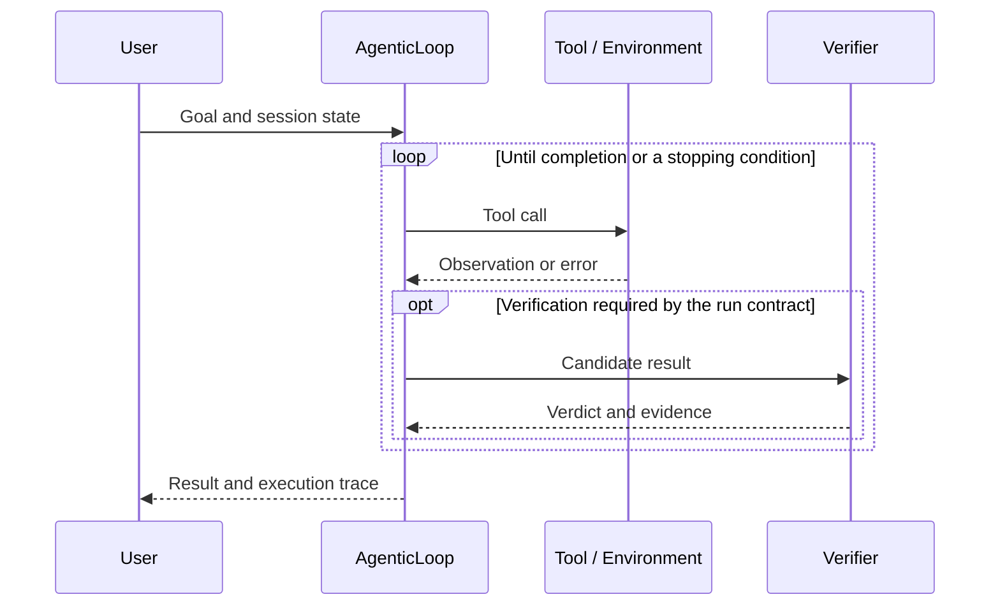

A model's completion statement, a verifier verdict, and a termination reason are different records. Separating context, execution, verification, and observation makes it possible to investigate which change affected the outcome.

[Code](https://github.com/mangowhoiscloud/geode) · [Landing page](https://mangowhoiscloud.github.io/geode/) · [Docs](https://mangowhoiscloud.github.io/geode/docs) · [Evaluation records](https://github.com/mangowhoiscloud/geode-eval-artifacts)

#### Harbor · Investigating score differences through execution records

I compared GEODE and native Codex in **paired rollouts** on Terminal-Bench 2.1. The two arms receive matched task/repetition assignments but work independently, with a separate container for each attempt. This is neither GEODE imitating Codex's actions nor production shadow traffic.

The plan covered **89 tasks × 5 repetitions × 2 arms = 890 cells**. A cell is `task × repetition × arm`. Both arms used the OpenAI subscription route to `gpt-5.6-sol`, with requested effort `max`. The historical GEODE arm connected `AgenticLoop` to one Harbor-backed `terminal_exec` tool; later full-runtime experiments are separate.

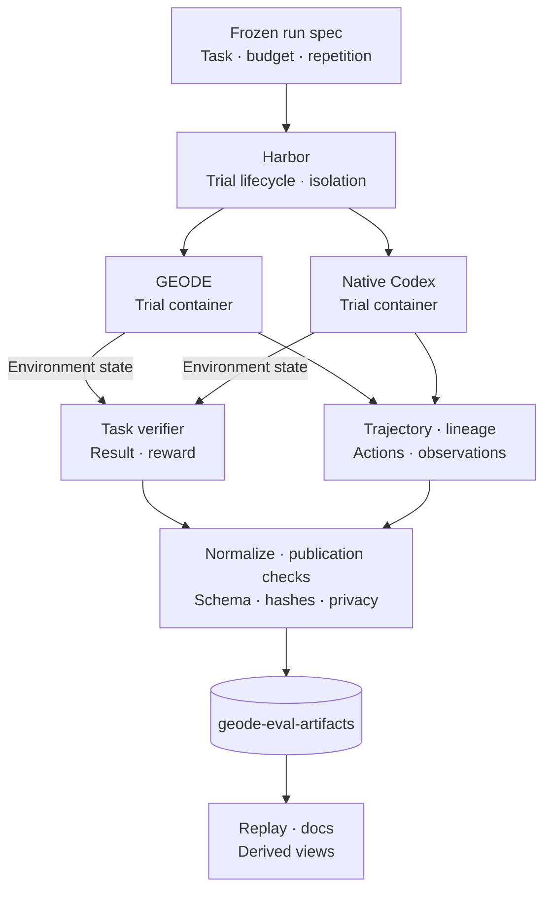

Harbor owns containers, timeouts, and task verifiers. **Scores follow verifier results and frozen selection rules; trajectories support investigation of tool calls and failure paths.** The branches represent independent arms, not simultaneous execution.

The secondary observation on 429 common-valid pairs recorded **339/429 passes for GEODE and 331/429 for Codex**. Infrastructure exclusions and unresolved cells leave the preregistered full-suite metric not measurable. This is not an official leaderboard rank or evidence that the current full GEODE runtime is superior.

[Execution contract and limits](https://github.com/mangowhoiscloud/geode/blob/main/docs/eval/terminal-bench-2.md) · [Public run artifacts](https://github.com/mangowhoiscloud/geode-eval-artifacts/tree/main/terminal-bench/terminalbench21-sol-max-fullsuite-paired-20260827t190300z) · [GEODE / Codex replay](https://mangowhoiscloud.github.io/geode/benchmarks/terminal-bench/replay/)

What was retained, and how was measurement improved?

| Data | Public files | What they support |
| --- | --- | --- |
| Execution contract | `run-spec.json`, `task-manifest.json` | Establish model, tasks, budgets, and comparison scope. |
| Attempt lineage | `attempts.jsonl` | Track original and supplementary attempts, validity, and selection. |
| Behavior records | `trajectory.json`, replay derivatives | Investigate action order and provenance from retained ATIF/session evidence. |
| Scoring evidence and analysis | `native-results.json`, `verifier-receipts.json`, `outcomes.json`, `analysis.json` | Distinguish raw reward, contract-selected outcomes, and aggregation denominators. |
| Publication manifest | `publication*.json` | Identify admitted files, hashes, and validation scope. |

Raw jobs remain private. Public derivatives pass schema, lineage, hash, secret, PII, and local-path checks. An ATIF-reconstructed `recording.cast` is **derived replay**, not an original PTY recording. Observer PTY capture is separate procedural evidence. Public replay does not expose every prompt or output body, and later reruns do not overwrite missing historical records or scores.

Follow-up integration review found missing cache-write separation in inclusive-input cost estimates, cleanup paths that could mask the first execution error, and unretained raw samples from failed performance checks. Changes corrected cost accounting, preserved the first error and original samples, and made usage producers and denominators explicit.

A later, **separate Astra smoke** froze its run spec and recorded reward 1/1, verifier 6/6, errors/retries 0/0, tool calls/results 2/2, and 0 orphans on Harbor 0.22.0. This is a 1/89-task, k=1 account-scoped integration check, not another sample in the `gpt-5.6-sol` comparison or evidence of suite-level performance, Reflexion effectiveness, or complete whole-runtime usage.

[Harbor gap closure PR #3311](https://github.com/mangowhoiscloud/geode/pull/3311) · [Terminal-Bench Astra smoke](https://github.com/mangowhoiscloud/geode/blob/main/docs/eval/2026-09-05-terminalbench-astra-openssl-smoke.md)

### Eco² · Let the work outlive the connection

I built and operated the backend and Kubernetes infrastructure for an AI recycling service. Long-running AI workers and the SSE connections delivering progress have separate lifetimes. The project received the **2025 AI SeSACTHON Excellence Award (4th/181)**. The service has closed.

| Workload | Execution model | Design focus |
| --- | --- | --- |
| Chat | Intent routing, selected domain nodes running in parallel, then a join | Choose the required work and combine its results into an answer. |
| Scan | Celery chain: Vision → Rule/RAG → Answer → Reward | Separate long-running execution from progress delivery. |
| Image generation | Separate graph branch | Use a distinct path from the other conversational work. |

Development, networking, placement, the two AI workflows, and observability are separate views. Expand only the detail you need below.

Cluster composition · Layers and placement boundaries inside Kubernetes

The backend README defines **Edge, Service, Integration, Persistence, and Platform** layers. Kubernetes control-plane components manage cluster state and scheduling; platform controllers manage deployment, mesh configuration, and scaling. Request-serving APIs, long-running workers, and progress delivery have separate lifetimes and scaling signals.

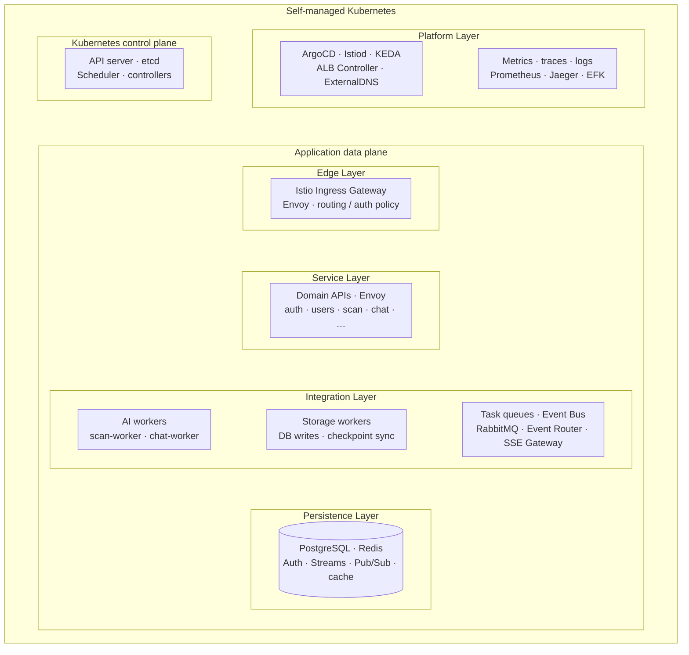

Boxes show **functional containment**, not individual servers or namespaces. ALB and Route 53 are outside Kubernetes; the following network view shows the actual ingress path. Application data plane means the area executing requests and work, not a synonym for the Persistence Layer. Istiod's Envoy configuration path is distinct from user traffic.

| Internal boundary | Responsibility and reason for separation |
| --- | --- |
| Edge / Service | The gateway routes requests and delegates authorization for covered paths; domain APIs handle HTTP/gRPC. `ext-authz` uses the `auth` namespace and auth-node placement selector. |
| Integration: execution | `worker-ai` handles Scan, Chat, and external LLM calls; `worker-storage` handles DB writes and checkpoint synchronization. Selectors and taints/tolerations separate execution resources. |
| Integration: delivery | RabbitMQ carries tasks. Redis Streams → Event Router → Pub/Sub → SSE Gateway carries progress events. `event-router` and `sse-consumer` are separate namespaces. |
| Persistence | PostgreSQL and Redis roles for authentication, Streams, Pub/Sub, and cache are distinct. State KV is a recovery-data role, not another database product or necessarily an independent server. |
| Platform | ArgoCD applies Git declarations; Istiod configures Envoy. KEDA scales target workloads from load signals while ArgoCD ignores replica fields. Metrics, traces, and logs use separate observation paths. |

**Physical placement does not map one-to-one to functional layers.** Terraform, Ansible, and dev manifests declare the following placements.

| Node / placement condition | Declared components |
| --- | --- |
| `k8s-master` / `role=control-plane` | Single kubeadm control plane. Istiod, ALB Controller, and ExternalDNS selectors, plus the ArgoCD installation procedure, use this node role. |
| `role=ingress-gateway` / `domain=auth` | Ingress Gateway and ext-authz use gateway and auth roles respectively. Gateway authorization delegation is distinct from the auth server's placement. |
| `domain=worker-ai` / `domain=worker-storage` | AI and storage work use separate worker-node groups. |
| `domain=event-router` / `domain=sse` | Event Router and SSE Gateway are separate. Event-processing load and open connections are different scaling signals. |
| `domain=data` / RabbitMQ affinity | PostgreSQL, purpose-specific Redis, and RabbitMQ nodes are declared. PostgreSQL's broad `domain=data` selector does not guarantee placement exclusively on its designated node. |
| Monitoring / logging nodes | KEDA selects `infra-type=monitoring`. Being a controller does not imply placement on the master. |

Namespaces, node placement, and NetworkPolicy are different boundaries. For example, `logging` disables Istio injection, so the entire cluster is not drawn as a single sidecar domain. Conflicting historical node counts are omitted. Single-master, PostgreSQL standalone, and RabbitMQ dev single-replica declarations are not presented as HA. This is the implementation of a closed service, not a live inventory.

[Five layers in the README](https://github.com/eco2-team/backend/blob/a0721271ac569679f1e4f19dd0745ab634a0c115/README.md#service-architecture) · [Node declarations](https://github.com/eco2-team/backend/blob/a0721271ac569679f1e4f19dd0745ab634a0c115/terraform/main.tf) · [kubeadm bootstrap](https://github.com/eco2-team/backend/blob/a0721271ac569679f1e4f19dd0745ab634a0c115/ansible/playbooks/02-master-init.yml) · [Namespace boundaries](https://github.com/eco2-team/backend/blob/a0721271ac569679f1e4f19dd0745ab634a0c115/workloads/namespaces/base/namespaces.yaml) · [Cluster manifests](https://github.com/eco2-team/backend/tree/a0721271ac569679f1e4f19dd0745ab634a0c115/clusters/dev/apps) · [Workload placement](https://github.com/eco2-team/backend/tree/a0721271ac569679f1e4f19dd0745ab634a0c115/workloads/domains)

Network topology · Requests, authorization, and asynchronous work

Route 53 handles DNS resolution; ALB terminates HTTPS. Its `instance` targets connect through **EC2 NodePort → Istio Ingress Gateway Pod**. The gateway's `CUSTOM` AuthorizationPolicy delegates covered API paths to ext-authz on the auth node. Istio/Envoy applies mesh routing and policies over Calico VXLAN and the kube-proxy Service path.

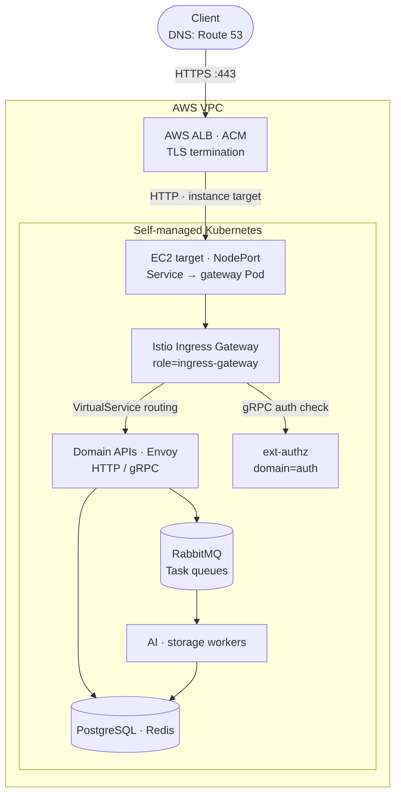

Solid arrows show request/task delivery; response arrows are omitted. ext-authz returns an authorization decision rather than proxying the entire application request. VirtualService configures gateway routing; it is not another proxy. AI workers make separate outbound HTTPS calls to external LLM APIs.

Dedicated gateway-Pod placement does not itself restrict ALB targets to that node. Terraform's EC2 declarations use public subnets, and **global `default-deny-all` is disabled**. This view does not claim private-only placement, ALB-only access, or network-wide default-deny isolation.

[ALB bridge configuration](https://github.com/eco2-team/backend/blob/a0721271ac569679f1e4f19dd0745ab634a0c115/workloads/routing/gateway/base/gateway.yaml) · [Istio and NodePort configuration](https://github.com/eco2-team/backend/blob/a0721271ac569679f1e4f19dd0745ab634a0c115/clusters/dev/apps/05-istio.yaml) · [VPC definition](https://github.com/eco2-team/backend/blob/a0721271ac569679f1e4f19dd0745ab634a0c115/terraform/modules/vpc/main.tf) · [Gateway authorization policy](https://github.com/eco2-team/backend/blob/a0721271ac569679f1e4f19dd0745ab634a0c115/workloads/routing/gateway/base/authorization-policy.yaml) · [NetworkPolicy configuration](https://github.com/eco2-team/backend/blob/a0721271ac569679f1e4f19dd0745ab634a0c115/workloads/network-policies/base/kustomization.yaml)

Meta-harness · How service and infrastructure changes are built

The developer captured context and verification procedures in `CLAUDE.md`, Skills, and an SDK-compatibility command. Claude Code is a **development-side coding agent**, not a Chat/Scan worker serving users in the cluster. This view connects build tools and artifacts; it is not one mandatory execution sequence.

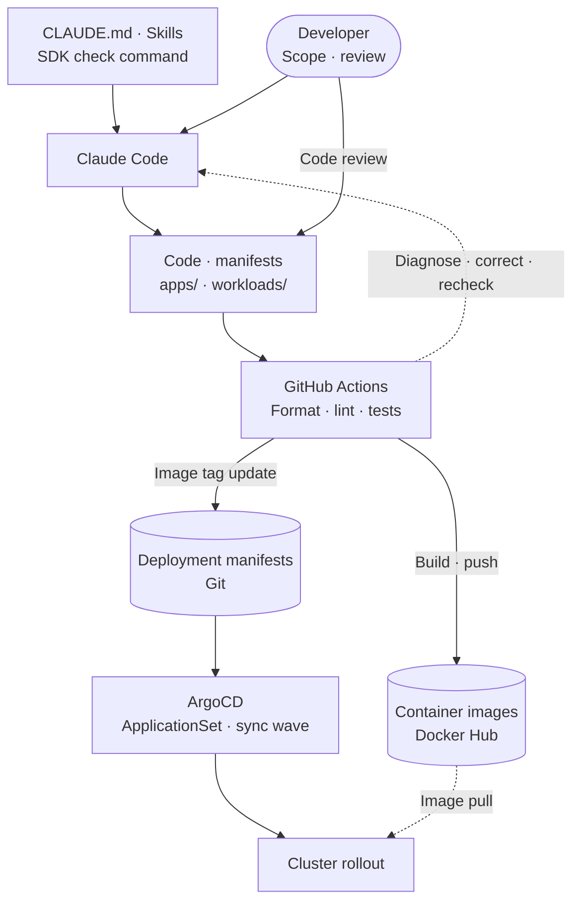

| Build component | Role |
| --- | --- |
| Instructions and Skills | `CLAUDE.md` and `.claude/skills/` provide domain context and architecture, code-review, Git-workflow, and Kubernetes-debugging procedures. |
| Tools and checks | `.claude/commands/check-sdk-compat.md` guides SDK-compatibility checks; CI runs format, lint, and tests for changed services. |
| Deployment artifacts | The cited CI runs quality checks on PRs. Qualifying push/manual runs build and push images, then update image tags in Git manifests. ArgoCD applies Git state. |

During development, failure logs guide correction and rechecking. This is a development procedure, not CI autonomously fixing code. Eco²'s service-scoped CI is not the same implementation as GEODE's baseline and contract ratchets. Development/review authority, CI checks, and ArgoCD deployment remain distinct responsibilities.

[Development context](https://github.com/eco2-team/backend/blob/a0721271ac569679f1e4f19dd0745ab634a0c115/CLAUDE.md) · [Skills and commands](https://github.com/eco2-team/backend/tree/a0721271ac569679f1e4f19dd0745ab634a0c115/.claude) · [Actual CI](https://github.com/eco2-team/backend/blob/a0721271ac569679f1e4f19dd0745ab634a0c115/.github/workflows/ci-services.yml) · [ArgoCD configuration](https://github.com/eco2-team/backend/blob/a0721271ac569679f1e4f19dd0745ab634a0c115/clusters/dev/apps/40-apis-appset.yaml)

Scan workflow · Separate execution from progress delivery

The Scan API registers work and returns `202 + job_id`. A Celery chain executes through stage-specific RabbitMQ queues while a separate SSE connection delivers progress. Closing that connection does not itself cancel the worker's job.

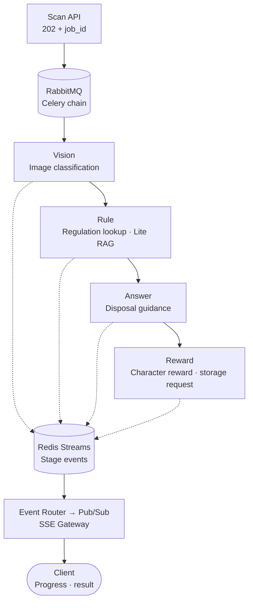

| Path | Storage and delivery rule |
| --- | --- |
| Tasks | `scan.vision → scan.rule → scan.answer → scan.reward` queues connect stages. Reward here grants service characters; it is not a GEODE benchmark reward. |
| Events | Workers `XADD`; the router reads through consumer groups. Failed processing leaves messages unacknowledged so a reclaimer can retry pending work. |
| Reconnection | Pub/Sub handles live delivery. State KV and Streams support recovery/catch-up; Pub/Sub itself is not the durable log. |

[Scan tasks](https://github.com/eco2-team/backend/tree/a0721271ac569679f1e4f19dd0745ab634a0c115/apps/scan_worker/presentation/tasks) · [Event Router / SSE incident and fix](https://rooftopsnow.tistory.com/237) · [Load test and bottleneck analysis](https://rooftopsnow.tistory.com/255)

Chat workflow · Select the needed tools, then join their results

The Chat API publishes to RabbitMQ; a TaskIQ worker executes LangGraph. The router selects nodes using intent and request context. The three branches below group node roles; they do not all run on every request.

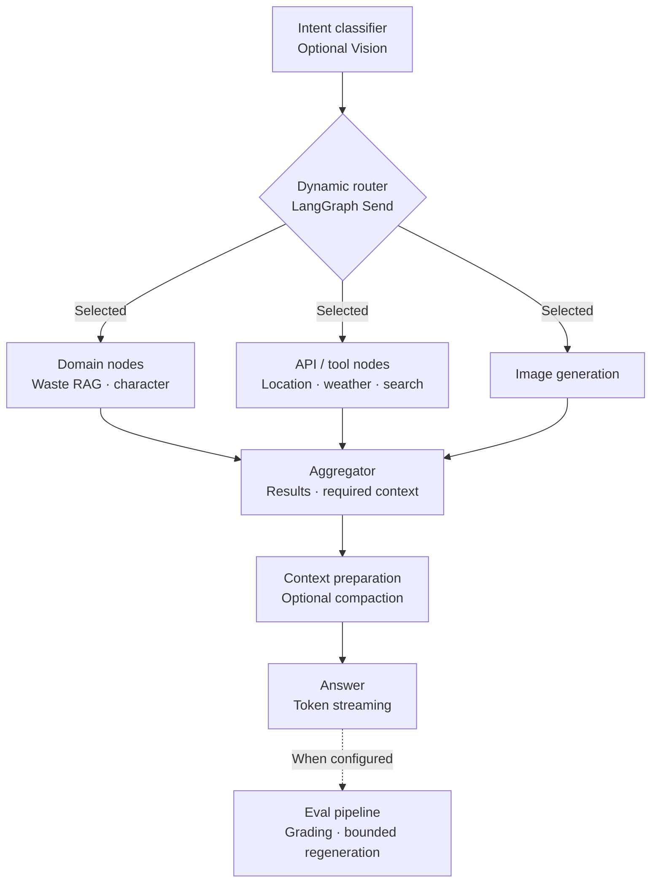

| Execution / state | Concrete responsibility |
| --- | --- |
| Selection and join | `Send` dispatches multiple intents; the aggregator collects results. RAG feedback and Eval depend on configuration, not unlimited retry. |
| Tool execution | Production wiring primarily chooses arguments with structured/function calls and executes application commands. This is not an unconstrained loop of multiple ReAct agents. |
| Conversation state | Checkpoints go to Redis; a syncer archives them asynchronously to PostgreSQL. Read-through from PG on a Redis miss and the consumer persisting conversation messages are separate paths. |
| User delivery | Answer token events also traverse Event Router and SSE Gateway. HTTP connections, worker execution, and checkpoint state have separate lifetimes. |

[Graph factory](https://github.com/eco2-team/backend/blob/a0721271ac569679f1e4f19dd0745ab634a0c115/apps/chat_worker/infrastructure/orchestration/langgraph/factory.py) · [Checkpoint implementation](https://github.com/eco2-team/backend/tree/a0721271ac569679f1e4f19dd0745ab634a0c115/apps/chat_worker/infrastructure/orchestration/langgraph/sync) · [Redis / PostgreSQL design record](https://rooftopsnow.tistory.com/242)

Observability · Which record explains a bottleneck or failure?

Queue buildup, Pod health, request paths, and LLM-node execution require different evidence. Operational metrics, logs, distributed traces, and LLM traces are collected through separate paths rather than collapsed into one score.

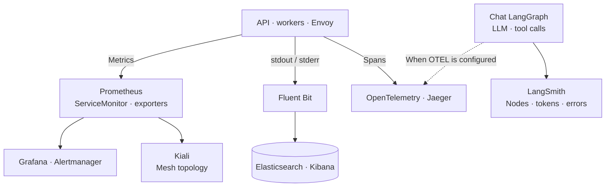

| Investigation | Records and use |
| --- | --- |
| Slow or queued work | Prometheus/Grafana queue depth, pending messages, connections, and Pod metrics help distinguish worker shortage from delivery bottlenecks. |
| Failed requests | Search structured logs, then use Jaeger spans to narrow the service/MQ/worker path. Kiali shows mesh relationships. |
| Slow LLM responses | LangSmith node execution, token usage, and error records help investigate tool waits and model calls. Availability depends on tracing configuration. |

Declared Istio trace sampling is 50%. This is a map of **collection paths and investigation methods**, not a claim that every request has a retained trace. Logs and traces are observational evidence, not verifier verdicts about answer quality.

[Logging manifests](https://github.com/eco2-team/backend/tree/a0721271ac569679f1e4f19dd0745ab634a0c115/workloads/logging) · [Trace sampling](https://github.com/eco2-team/backend/blob/a0721271ac569679f1e4f19dd0745ab634a0c115/workloads/routing/global/telemetry.yaml) · [LangSmith wiring](https://github.com/eco2-team/backend/blob/a0721271ac569679f1e4f19dd0745ab634a0c115/apps/chat_worker/infrastructure/telemetry/langsmith.py) · [Monitoring / tracing deployment](https://github.com/eco2-team/backend/tree/a0721271ac569679f1e4f19dd0745ab634a0c115/clusters/dev/apps)

Improvement loop · How observed failures changed the next architecture

Eco² evolved less like a sequence of “new technologies added” and more like a loop of **reproducing the same pressure, narrowing a bottleneck hypothesis, deploying the smallest change, and measuring the same signal again**. This was not a production runtime rewriting its own source; it was an external engineering loop shared by a human and a coding agent.

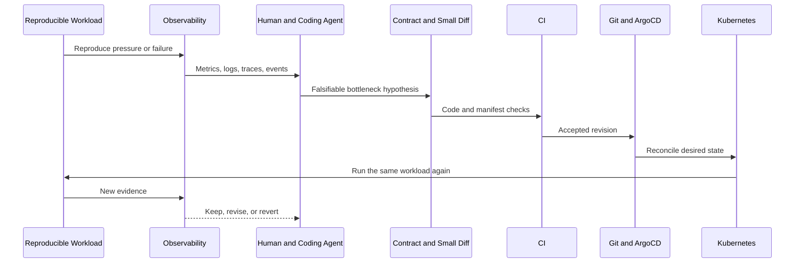

| Observed pressure | Hypothesis | Change | What the next measurement revealed |
| --- | --- | --- | --- |
| Around 50 VU, SSE connections, RabbitMQ connections, and scan-api memory rose together until readiness returned 503s | task lifetime and progress-delivery lifetime were coupled | keep RabbitMQ for tasks, move progress to Redis Streams → Event Router → SSE Gateway | after connection amplification was reduced, queue wait, worker state, and external APIs became the next bottleneck candidates |
| ACK after publish failure, reconnect gaps, duplicates, and a hot Pub/Sub channel | event delivery needed an explicit recovery contract, not only a fast live path | add ACK-on-success, reclaim, dedupe, Last-Event-ID catch-up, master-only Pub/Sub, and four-way sharding | recoverability after failure became a separate verification target |
| repeated VU sweeps showed probe restarts and in-flight loss mattered more than raw CPU or memory in some failures | a guardrail can create a new failure when it mismatches the workload | tune KEDA min/max and workload signals; isolate probe behavior as its own cause | **the guardrail itself became an object of verification** |
| one judge score could not explain Chat-answer quality failures | generation quality and evaluator reliability should not collapse into one score | split deterministic Code Grader, BARS LLM Judge, and Calibration Monitor | the measurement apparatus itself required drift and wiring validation, a lesson later carried into GEODE's evaluator separation |

The important result is not a single success number but **a failure becoming a contract**. ACK rules, recovery behavior, KEDA fallback, CI checks, and Git desired state are deterministic boundaries rather than model judgements. Observability had no promotion authority; it was the feedback surface for the next hypothesis. A human retained the final keep/revise/revert decision.

In compact form:

`failure signal → reproducible workload → hypothesis → scoped code/manifest diff → CI → Git/ArgoCD → same workload → human verdict → next contract`

GEODE later turns this loose external loop into explicit trajectories, revision-bound evaluation, ratchets, and promotion contracts. Eco² used production failures as input to the next change; GEODE makes the loop itself a reproducible research object.

The public project report gives a **Scan success rate of 97.8% at 1,000 VU**. A separate ext-authz load record gives **1,477 RPS at 2,500 VU**. These are different workloads, not real-user counts or one combined performance score. A mismatch between completion counts and the reported success-rate denominator is documented in the [source notes](docs/PROFILE_NOTES.md#eco2).

[Portfolio](https://mangowhoiscloud.github.io/eco2/) · [Project repository](https://github.com/eco2-team/backend)

### Experimental Loop · A higher score is not enough to adopt a change

The search space is **scaffolding around the model**, including instructions, tool policy, Skills, and task decomposition, not model weights. Baseline and candidate share tasks, evaluator, and budget. A Ledger retains every attempt and verdict.

When the Baseline changes: KEEP / REJECT / INVALID

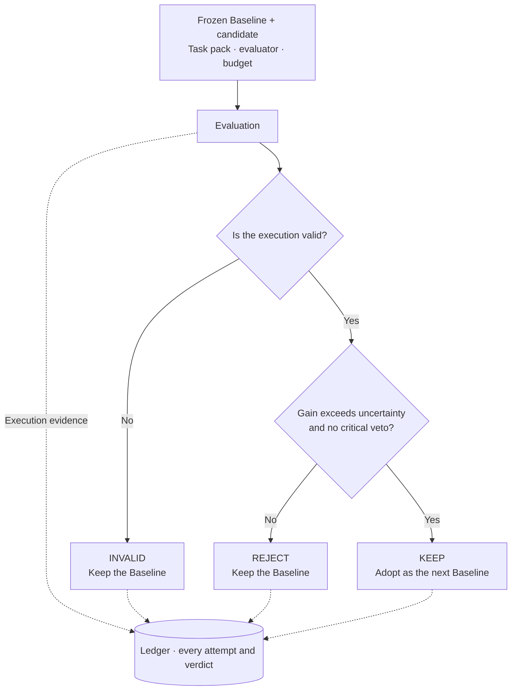

The Ratchet applies these conditions. A score increase alone, a tie, or an incomplete run does not change the baseline. `KEEP` is an experiment verdict, not deployment approval or evidence of sustained self-improvement.

[Two loops](https://mangowhoiscloud.github.io/geode/docs/concepts/two-loops/) · [Experiment design · frozen experiment kernel](https://github.com/mangowhoiscloud/geode/blob/main/docs/architecture/crucible-kernel.md) · [RSI experiment records](https://mangowhoiscloud.github.io/geode/self-improving/)

### REODE @ pinxlab · Code migration

A GEODE-derived code-migration harness combining OpenRewrite with LLM-based contextual repair. A **5,523-file** Java 1.8→22 and Spring 4→6 delivery passed **83/83 tests** plus frontend/backend end-to-end verification.

The March 2026 delivery record covers 33 autonomous sessions, 1,133 rounds, and 5h 48m. Zero human intervention applies to that recorded run, not project preparation or final review. [Delivery scope](docs/PROFILE_NOTES.md#reode)

## Evolution

Each project changed what needed to be verified.

| Work | Problem | Design carried forward |
| --- | --- | --- |
| Eco² | AI work, connections, and deployments have different lifetimes. | Asynchronous execution, event recovery, and separate operational owners |
| GEODE | Service-specific implementations need a reusable runtime. | Separate agent execution from the system that builds the harness |
| SIL | Scaffold changes need safety measurements. | External audits, critical-dimension floors, and failure records |
| Crucible | Passing rows from different revisions do not validate the final candidate. | Freeze candidate, evaluator, and task pack before comparison and promotion |

SIL → Crucible: a failure that changed the experiment design

SIL used Petri-style multidimensional safety audits to evaluate scaffold candidates, connecting generation, audit, adoption, and revert with transcript and cost records.

The July 2026 Crucible campaign exposed a problem: passing rows from different candidate revisions had been combined into an apparent target-set closure. That did not prove the final candidate passed all earlier rows. G4 rows inspected and used for repair could no longer count as held-out evidence.

The current contract freezes candidate commit, evaluator/harness identity, content-bound task pack, paired comparison rule, budget, and vetoes before execution. Failed training rows may inform the next candidate; an opened sealed row cannot be reused for the same promotion claim.

[Crucible frozen experiment kernel](https://github.com/mangowhoiscloud/geode/blob/main/docs/architecture/crucible-kernel.md) · [Historical Self-Improving Roadmap](https://github.com/mangowhoiscloud/geode/blob/main/docs/plans/2026-05-22-self-improving-roadmap.md)

**RSI (Recursive Self-Improvement) is a research direction, not a claimed achievement.** Current work builds an external system to execute, measure, and judge scaffold changes. The next evidence needed is whether adopted changes remain effective on other task families and fresh sealed evidence.

## How I work

- **Make hypotheses falsifiable.** Specify the task family, candidate change, metric, and veto before execution.
- **Build the smallest reproduction.** Find the failing input and call path, then define what may change and what must remain fixed.
- **Leave the investigation in the implementation.** Confirmed causes become regression tests; repeatable investigations become Skills. Investigate a failed check before lowering its threshold.

Task decomposition, context, tool choice, verification order, and evaluator composition can also become candidate variables. Individual runs have bounded budgets; the methodology is not treated as a fixed answer.

## Verification, reproduction, and records

A Trajectory is research data. I connect **who produces a record, who reads it, and which decision it supports**.

| Producer | Record | Reader and decision |
| --- | --- | --- |
| Runtime | Requests, tool calls/results, observations, retries, termination reason | An engineer identifies the failure and reproduction conditions. |
| Evaluator | Run spec, revision, task ID, verifier result | Comparison analysis establishes valid samples and scores. |
| Promotion gate | Ledger, lineage, KEEP / REJECT / INVALID | The experiment system selects the next Baseline or retains the current one. |
| Operator | CI, installation, deployment checks, and approval | A human authorizes code merge and deployment. |

Original records remain separate from derived summaries, with provenance and privacy checked before publication. Local tests, external evaluations, CI, and deployment checks do not substitute for one another.

The [Harbor paired-rollout case](#harbor-rollout) shows the concrete files and measurement repairs.

Terms: agent · harness · meta-harness · RSI

- **Agent:** uses tools to make progress on a task.
- **Harness:** manages tools, memory, permissions, failure handling, and verification.
- **Meta-harness:** builds, verifies, and revises the harness's code and scaffold.
- **RSI:** a research direction in which earlier evidence informs later changes and experiments. Adoption and repeated improvement require separate evidence.

## Experience

| Period | Experience |
| --- | --- |
| 2026.02–present | **GEODE** · Solo development · SIL 2026.05–06 · Crucible 2026.07 · Harbor × Terminal-Bench 2.1, 890-cell rollout plan with Codex control, 2026.08–09 |
| 2026.03–05 | **pinxlab** · Freelance, sole developer · REODE, Kiki, Cotton |
| 2025.10–2026.02 | **Eco²** · Backend/infrastructure in a five-person FE/design/AI/backend-infra team (one month), then solo development and operation (three months) · 2025 AI SeSACTHON Excellence Award |
| 2024.12–2025.08 | **Rakuten Symphony Korea** · Jr. Cloud Engineer, Storage Developer · Full-time · PB-scale distributed storage |
| 2024.07–11 | **Kakao Tech Bootcamp** · Backend, DevOps, LLM |
| 2017.03–2023.08 | **Pusan National University** · B.S., Computer Science & Engineering |

Rakuten work included **Rakuten Cloud Native Platform, Storage Server v5.5.0 · Rakuten Storage v1.0.0**.

Other work

- **Kiki @ pinxlab · 2026.04–05:** Slack-directed multi-agent analysis, implementation, and review with a two-stage gate.
- **Cotton @ pinxlab · 2026.05:** RPG translation SaaS modeling dialogue as a graph.
- **[Crumb & Crumb Studio](https://github.com/mangowhoiscloud/crumb) · 2026.05:** replayable CLI-agent game-studio experiment.
- **[DREAM](https://github.com/KakaoTech-Hackathon-Dream) · 2024.09:** generative AI narrative and image service.
- **[Aimo](https://github.com/KTB16Team) · 2024:** LLM-based conflict-mediation backend.

## Notes

I document implementation and experiments on my [blog](https://rooftopsnow.tistory.com) and [YouTube](https://www.youtube.com/@mango_fr). Previous GitHub account: [@mng990](https://github.com/mng990)

Content reviewed: 2026-09-18 · <a href="docs/PROFILE_NOTES.md">Sources, scope, and maintenance notes</a>

