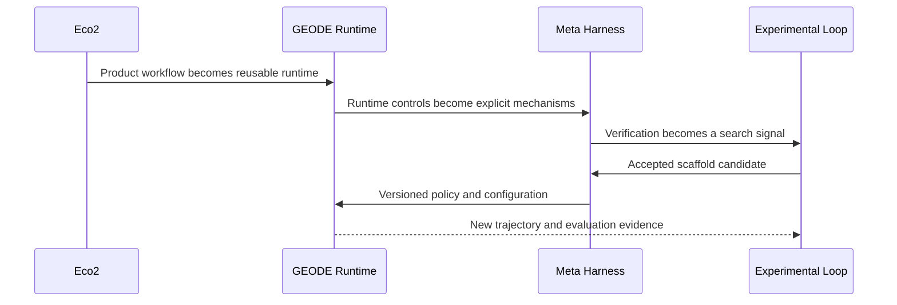
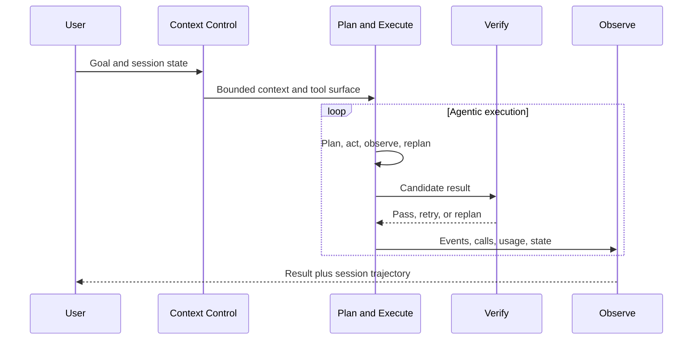
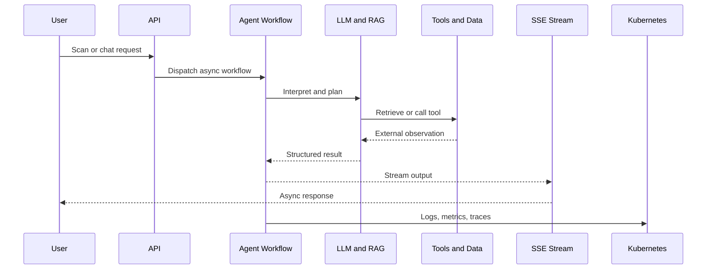
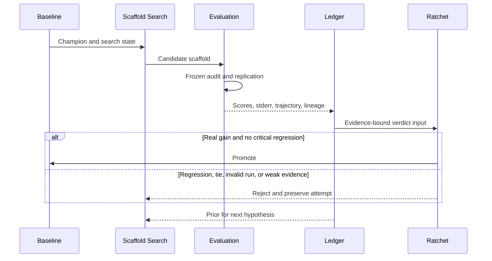
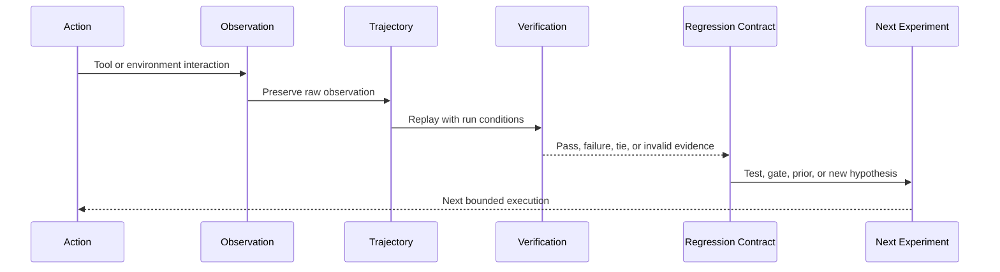

<a href="README.md">한국어</a> · <strong>English</strong>

# Jihwan Ryu

**I build verifiable systems, then feed their results back into the next search.**

My background spans distributed storage, backend engineering, and cloud infrastructure. Today I work on **autonomous agent runtimes and RSI (Recursive Self-Improvement) methodology**. I care about observable, reproducible execution and about preserving results and failures as material for the next experiment.

[GEODE](https://mangowhoiscloud.github.io/geode/) · [Technical blog](https://rooftopsnow.tistory.com) · [YouTube](https://www.youtube.com/@mango_fr) · [LinkedIn](https://linkedin.com/in/jihwan-ryu-b6b04a202)

`RSI / scaffold search` · `Autonomous agent runtime` · `Cloud / Kubernetes / IaC` · `Evidence / trajectories`

[How I work](#how-i-work) · [Evolution](#evolution) · [Selected work](#selected-work) · [Verification and records](#evidence) · [Concepts](#concepts) · [Experience](#experience) · [Notes](#more)

## How I work

**Bound the problem first.** I find the failing input and actual call path, define what may change, then construct the smallest reproducible condition.

**Use models for exploration and evidence for decisions.** AI helps form hypotheses and implementation candidates. Tests, original logs, execution records, and external verification decide whether a change holds.

**Preserve results as data for the next search.** Successful changes, failed attempts, rejected hypotheses, trajectories, and evaluation results remain available. Causes become regression tests; repeatable investigations become Skills or procedures.

**Treat methodology itself as a search space.** Task decomposition, context, tool selection, verification order, Skills, agent roles, evaluator composition, and human intervention can all become candidate variables. Individual runs are bounded; the search space stays open.

## Evolution

Eco² was a production service where I built an **asynchronous agent workflow and cloud runtime**. GEODE separated those lessons into a reusable **autonomous agent runtime and meta-harness**. The current Experimental Loop feeds execution and evaluation evidence back into an **outer scaffold-search loop**.

The progression is mainly about separating the layers that **execute, control, observe, and improve** a stochastic system.

## Selected work

### GEODE

An **autonomous agent runtime** with long-running memory, multi-provider routing, tool execution, permission boundaries, observability, and evaluation. The distribution separates `core` for execution, `evals` for evidence production, and `evolve` for experimental scaffold search.

Its meta-harness groups control mechanisms into Context Control, Plan and Execute, Verify, Observe, and Scaffold. These are code-backed control surfaces rather than conceptual labels.

Context budgets and compaction, dynamic replanning and convergence detection, verification modes and safety gates, event persistence, and session timelines live at different layers so each can be measured and changed independently.

[Code](https://github.com/mangowhoiscloud/geode) · [Docs](https://mangowhoiscloud.github.io/geode/docs) · [Meta-harness catalog](https://mangowhoiscloud.github.io/geode/docs/reference/meta-harness-catalog) · [Execution and evaluation records](https://github.com/mangowhoiscloud/geode-eval-artifacts) · [RSI experiments](https://mangowhoiscloud.github.io/geode/self-improving/)

### Eco²

An AI recycling service that evolved from a chatbot into a multi-agent workflow using Vision LLM, RAG, tool calls, LangGraph-based processing, asynchronous SSE, and a Kubernetes platform.

The main lesson was operating models inside a service runtime: asynchronous work, streaming, external data, observability, authorization, deployment automation, and load verification had to move together. This became the starting point for GEODE's runtime and meta-harness split.

**Recorded milestones:** **2025 AI SeSACTHON Excellence Award (4th/181)**, **24-node Kubernetes** with Terraform, Ansible, and ArgoCD, Scan API **97.8% at 1,000 VU**, and a separate ext-authz path at **1,477 RPS with 2,500 VU**. VU means virtual users, not actual users. The service has closed.

[Technical portfolio](https://mangowhoiscloud.github.io/eco2/) · [Project repository](https://github.com/eco2-team/backend)

### Experimental Loop

GEODE's outer loop searches **scaffolding around the model**, not model weights. System instructions, tool policy, Skills, and task decomposition can become candidates. A frozen measurement layer evaluates them before promotion or rejection.

**The ratchet does not move because a single score increased.** Candidate edits and measurement apparatus stay separate. Critical-dimension regressions can veto promotion, gain is compared against uncertainty, and baseline plus result ledgers are retained. Promotion changes the next baseline; rejection searches another hypothesis against the same baseline. CI adds deterministic ratchets for architecture, repository hygiene, prompt integrity, behavior, and coverage.

[Two loops](https://mangowhoiscloud.github.io/geode/docs/concepts/two-loops) · [Experiment loop](https://mangowhoiscloud.github.io/geode/docs/self-improving/loop-overview) · [Public evaluation records](https://github.com/mangowhoiscloud/geode-eval-artifacts)

### Compiler AX Lab

Independent research on handing over **reviewable changes with cause, diff, and execution evidence**. Public CPU records dated 2026-09-16 include **46,080 matching output values**, **720 regular tests**, and **55 doctests**. Separate executions are not combined into one score; the A/B controls tied, and CPU checks do not establish NPU performance. The project is unaffiliated with FuriosaAI.

[Code and verification boundaries](https://github.com/mangowhoiscloud/compiler-ax-lab) · [Retrospective report](https://mangowhoiscloud.github.io/compiler-ax-lab/report.pdf)

### REODE @ pinxlab

A GEODE-derived code-migration harness combining OpenRewrite with LLM-based contextual repair. A **5,523-file** Java 1.8→22 and Spring 4→6 delivery passed **83/83 tests** plus frontend/backend end-to-end verification. The recorded run covered 33 autonomous sessions, 1,133 rounds, and 5h 48m with zero human intervention during that run, not zero preparation or review.

[Delivery scope](docs/PROFILE_NOTES.md#reode)

## Verification, reproduction, and records

**Verification checks the contract.** Local tests, CI, external evaluation, installation, and deployment checks do not substitute for one another. Each record states what it actually established.

**Reproduction starts by freezing conditions.** Model route, harness revision, task set, effort, timeout, seed, and attempt lineage stay attached to a run when they can affect the result. Baseline and candidate share measurement conditions; errored or quota-contaminated runs stay separate.

**A trajectory is research data.** Requests, tool calls, external observations, failures, retries, and final verdicts form an execution trace. Successful trajectories show which controls were active. Failed trajectories become material for regression tests and mutation hypotheses. Original records take precedence over summaries, with provenance and privacy review for published artifacts.

**A ratchet automates memory.** An understood failure becomes a regression test or deterministic check. A promoted baseline becomes the next reference. When a check fails, the first response is investigation, not relaxing the threshold.

## Concepts

An **agent** uses tools to make progress. A **harness** manages tools, memory, permissions, failure handling, and verification. A **meta-harness** makes that harness observable, bounded, and evolvable. **RSI (Recursive Self-Improvement)** here means feeding evidence from earlier executions back into later changes and experiments while keeping adoption and repeated improvement as separate claims.

<strong>Other work</strong>

**Kiki @ pinxlab · 2026.04–05:** Slack-directed multi-agent analysis, implementation, and review with a two-stage gate.  
**Cotton @ pinxlab · 2026.05:** RPG translation SaaS modeling dialogue as a graph.  
**[Crumb & Crumb Studio](https://github.com/mangowhoiscloud/crumb) · 2026.05:** replayable CLI-agent game-studio experiment.  
**[DREAM](https://github.com/KakaoTech-Hackathon-Dream) · 2024.09:** generative AI narrative and image service.  
**[Aimo](https://github.com/KTB16Team) · 2024:** LLM-based conflict-mediation backend.

## Experience

| Period | Experience |
| --- | --- |
| 2026.09 | **Compiler AX Lab** · CPU-test and workflow research |
| 2026.02–present | **GEODE** · Solo development · SIL 2026.05–06 · Crucible 2026.07–present |
| 2026.03–05 | **pinxlab** · Freelance · REODE, Kiki, Cotton |
| 2025.10–2026.02 | **Eco²** · Backend/infrastructure to solo development and operation · 2025 AI SeSACTHON Excellence Award |
| 2024.12–2025.08 | **Rakuten Symphony Korea** · Jr. Cloud Engineer, Storage Developer · PB-scale distributed storage |
| 2024.07–11 | **Kakao Tech Bootcamp** · Backend, DevOps, LLM |
| 2017.03–2023.08 | **Pusan National University** · B.S., Computer Science & Engineering |

Rakuten work included **Rakuten Cloud Native Platform, Storage Server v5.5.0 · Rakuten Storage v1.0.0**.

## Notes

I document implementation and experimental findings on my [blog](https://rooftopsnow.tistory.com) and [YouTube](https://www.youtube.com/@mango_fr). [LinkedIn](https://linkedin.com/in/jihwan-ryu-b6b04a202) · Previous GitHub account: [@mng990](https://github.com/mng990)

Content reviewed: 2026-09-17 · <a href="docs/PROFILE_NOTES.md">Sources, scope, and maintenance notes</a>

