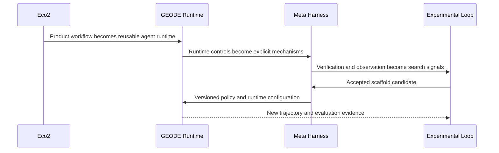
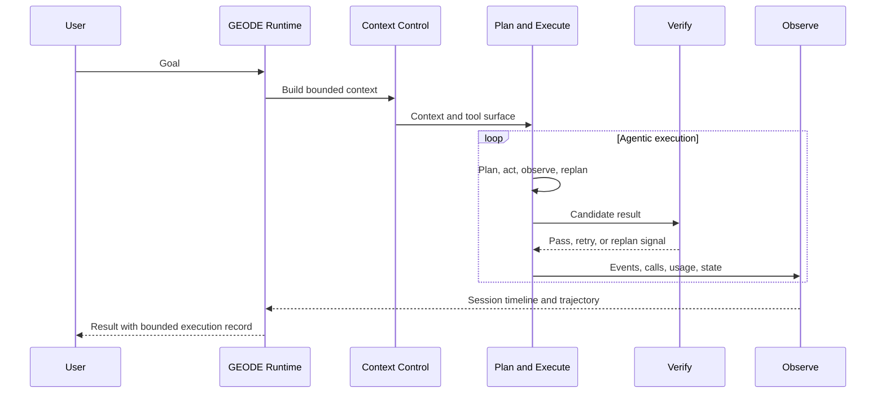
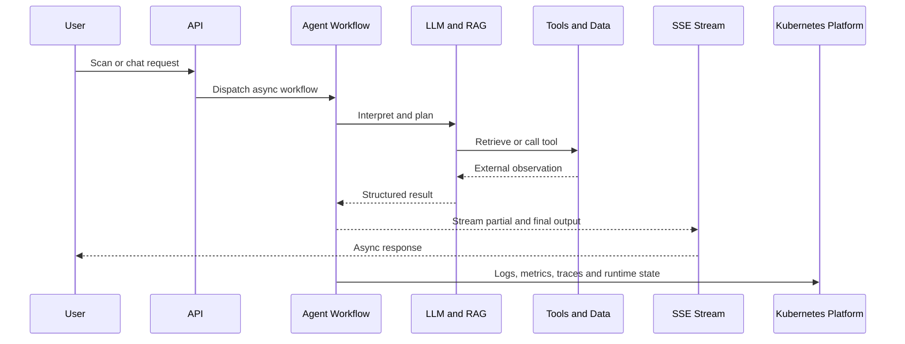
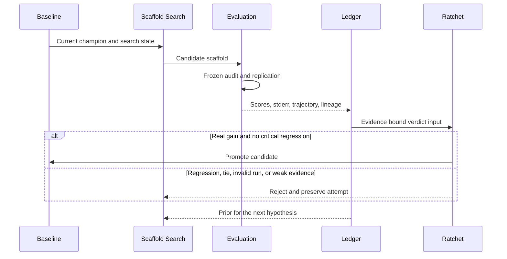
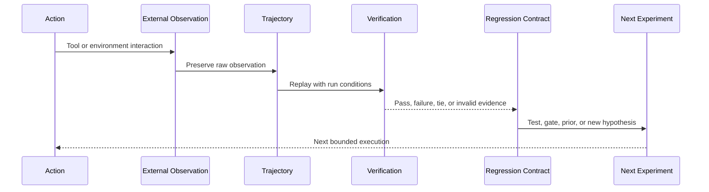

<p align="right"><a href="README.md">한국어</a> · <strong>English</strong></p>

# Jihwan Ryu

**I build verifiable systems, then feed their results back into the next search.**

My background spans distributed storage, backend engineering, and cloud infrastructure. Today I work on **autonomous agent runtimes and RSI (Recursive Self-Improvement) methodology**. I care less about a model succeeding once than about whether execution is observable and reproducible, and whether results and failures remain useful as material for the next experiment.

Each execution is bounded by explicit scope and verification conditions. The search space is not. I treat task decomposition, context construction, tool policy, Skills, evaluation methods, agent roles, and points of human intervention as variables in the methodology itself.

[GEODE](https://mangowhoiscloud.github.io/geode/) · [Technical blog](https://rooftopsnow.tistory.com) · [YouTube](https://www.youtube.com/@mango_fr) · [LinkedIn](https://linkedin.com/in/jihwan-ryu-b6b04a202)

[](https://github.com/mangowhoiscloud/geode/releases/latest)

`RSI / scaffold search` · `Autonomous agent runtime` · `Cloud / Kubernetes / IaC` · `Evidence / trajectories`

[How I work](#how-i-work) · [Evolution](#evolution) · [Selected work](#selected-work) · [Verification and records](#evidence) · [Concepts](#concepts) · [Experience](#experience) · [Notes](#more)

<a id="how-i-work"></a>
## How I work

**Bound the problem and verification surface first.** I find the failing input and actual call path, define what may change and what must remain intact, then construct the smallest reproducible condition.

**Use models for exploration and evidence for decisions.** I use AI actively to form hypotheses and implementation candidates, but establish a change through tests, original logs, execution records, and external verification.

**Preserve results as data for the next search.** Successful changes, failed attempts, rejected hypotheses, execution trajectories, and evaluation results remain available. Causes become regression tests, repeatable investigations become Skills or procedures, and the records become inputs to the next candidate and search strategy.

**Treat methodology itself as a search space.** Task decomposition, context, tool selection, verification order, Skills, agent roles, evaluator composition, and human intervention can all become candidate variables. I measure again under comparable conditions and let the result determine the next direction of search.

**Bound individual runs without closing the search space.** Code changes, CI, merge, installation, and deployment are checked separately. A tied experiment remains a tie, and a result is not extended beyond the scope that was measured.

<a id="evolution"></a>
## Evolution

The work developed through three stages. Eco² was a production service where I built an **asynchronous agent workflow and cloud runtime**. GEODE separated those lessons into a reusable **autonomous agent runtime and meta-harness**. The current Experimental Loop feeds execution and evaluation evidence back into an **outer scaffold-search loop**.



The important change was not simply adding more agents. It was **separating the layers that control and observe execution**. Service-oriented orchestration in Eco² became explicit Context Control, Plan and Execute, Verify, and Observe mechanisms in GEODE. Scaffold then became a separate search surface. GEODE's current meta-harness catalog maps these five areas to code paths and real control surfaces.

<a id="selected-work"></a>
## Selected work

### GEODE

An **autonomous agent runtime** that plans work and calls tools from a natural language request. I have built its long-running memory, multi-provider connections, tool execution, permission boundaries, observability, and evaluation layers as a solo project.

The current distribution separates `core`, `evals`, and `evolve`. `core` executes work, `evals` produces evidence through audits and benchmark adapters, and `evolve` uses that evidence to search experimental scaffold candidates. Inside the runtime, Context Control, Plan and Execute, Verify, and Observe constrain stochastic execution. The Scaffold layer manages the rules and ratchets used to build GEODE itself.



The meta-harness is not a separate product. It is the **set of mechanisms that constrain and converge a stochastic runtime**. Context budgets and compaction, dynamic replanning and convergence detection, verification modes and safety gates, event persistence, and the session timeline live at different control layers.

[Code](https://github.com/mangowhoiscloud/geode) · [Docs](https://mangowhoiscloud.github.io/geode/docs) · [Meta-harness catalog](https://mangowhoiscloud.github.io/geode/docs/reference/meta-harness-catalog) · [Execution and evaluation records](https://github.com/mangowhoiscloud/geode-eval-artifacts) · [RSI experiments](https://mangowhoiscloud.github.io/geode/self-improving/)

### Eco²

An AI recycling service. I started as the backend and infrastructure engineer in a five-person team, then continued development and operation solo. Vision LLM, RAG, tool calls, LangGraph-based multi-agent processing, and asynchronous SSE responses were connected to a real service and Kubernetes environment.



The central lesson from Eco² was not the model call itself, but **operating models inside a service runtime**. Asynchronous work, streaming, external data, observability, authorization paths, deployment automation, and load verification had to move together. That experience became the starting point for separating runtime and meta-harness concerns in GEODE.

**Recorded milestones:** the **2025 AI SeSACTHON Excellence Award (4th/181)** and a **24-node Kubernetes cluster** managed with Terraform, Ansible, and ArgoCD. Public load records report the Scan API at **97.8% with 1,000 VU**, and a separate ext-authz path at **1,477 RPS with 2,500 VU**. VU means virtual users in a load test, not actual users.

The service has closed. Its architecture and engineering lessons remain in the technical portfolio.

[Technical portfolio](https://mangowhoiscloud.github.io/eco2/) · [Project repository](https://github.com/eco2-team/backend)

### Experimental Loop

GEODE's outer loop does not train model weights. It creates **scaffold candidates** across system instructions, tool policy, Skills, and task decomposition, measures them through a frozen evaluation layer, then promotes or rejects them. The public record demonstrates an experimental contract for generating, measuring, and rejecting candidates rather than proof of sustained recursive improvement.



**The ratchet does not move because a single score increased.** Measurement apparatus and candidate edits stay separate, critical-dimension regressions can veto promotion, and gain is compared against a stderr margin. Baselines and result ledgers are retained, including failed candidates. Promotion changes the next baseline; rejection searches another hypothesis against the same baseline. CI adds deterministic ratchets for architecture, repository hygiene, prompt integrity, behavior, and coverage.

[Two loops](https://mangowhoiscloud.github.io/geode/docs/concepts/two-loops) · [Experiment loop](https://mangowhoiscloud.github.io/geode/docs/self-improving/loop-overview) · [Public evaluation records](https://github.com/mangowhoiscloud/geode-eval-artifacts)

### Compiler AX Lab

Independent research on handing over **reviewable changes with their cause, diff, and execution evidence** rather than plausible-looking code alone. The public project contains Rust tests for the public `furiosa-opt` SDK and a Python runner. It is unaffiliated with and not approved by FuriosaAI.

Public CPU records dated 2026-09-16 include **46,080 matching output values**, plus a workspace run with **720 regular tests and 55 doctests passing**. These are separate executions and are not combined into one score. The A/B pilot's control results were tied, and CPU value checks do not establish NPU correctness, execution overlap, or performance.

[Code and verification boundaries](https://github.com/mangowhoiscloud/compiler-ax-lab) · [Retrospective report](https://mangowhoiscloud.github.io/compiler-ax-lab/report.pdf)

### REODE @ pinxlab

I redesigned the GEODE-derived harness into a code-migration product. OpenRewrite handled rule-based changes while LLMs handled parts requiring contextual interpretation. When a repair repeatedly returned to the same error, I introduced an investigate-before-fixing procedure.

**March 2026 delivery record:** a **5,523-file** service targeting Java 1.8→22 and Spring 4→6 passed **83/83 tests plus frontend and backend end-to-end verification**. The recorded execution covered 33 autonomous sessions, 1,133 rounds, and 5 hours 48 minutes with zero human intervention during that run. This does not mean there was no preparation, design, or final review.

Client code is private. The [previously public delivery summary and measurement scope](docs/PROFILE_NOTES.md#reode) remain available.

<a id="evidence"></a>
## Verification, reproduction, and records

**Verification checks the contract, not the appearance of the result.** I define invariants and measurement scope before execution. Local tests, CI, external evaluation, installation checks, and deployment checks do not substitute for one another. Each record states what the check actually established.

**Reproduction starts by freezing conditions, not merely obtaining the same number twice.** Model route, harness revision, task set, effort, timeout, seed, and attempt lineage are bound to the run record when they can affect the result. Baseline and candidate share measurement conditions, while quota-contaminated or errored runs remain separate from valid observations.

**A trajectory is research data, not only a debugging log.** The request, tool calls, external observations, failures and retries, and final verdict form an execution trace. Successful trajectories show which controls were active. Failed trajectories become material for regression tests and mutation hypotheses. Original records take precedence over summaries, with provenance and privacy review attached to published artifacts.



**A ratchet automates memory.** Once a failure is understood, it becomes a regression test or deterministic check. A promoted baseline becomes the reference for the next comparison. When a check fails, I investigate the cause rather than relaxing the threshold first. If a test must be removed, the surviving invariant is reviewed separately. Execution records, tests, CI, and experiment ledgers therefore form one chain: observation becomes a contract, and the contract constrains the next change.

<a id="concepts"></a>
## Concepts

An **agent** uses tools to make progress on a task instead of only generating an answer. A **harness** manages tools, memory, permissions, failure handling, and verification around that execution. A **meta-harness** is the set of control mechanisms that makes the harness itself observable, bounded, and evolvable.

**RSI (Recursive Self-Improvement)** refers here to feeding evidence from earlier executions back into later changes and experiments. GEODE searches the execution scaffold rather than directly training model weights. Adoption of a change and repeated improvement require separate evidence.

```text
task loop: goal -> tool execution -> inspect result -> next action
search loop: candidate -> evaluation -> record -> next candidate and search strategy
```

<details>
<summary><strong>Concepts used for verification and search</strong></summary>

**Skill:** task-specific instructions retrieved when needed. A Skill still needs to be used and evaluated on subsequent work.

**Regression test:** a check that detects whether a resolved problem returns.

**Ratchet:** a mechanism that prevents an established verification standard from being quietly weakened.

**Evaluation gate:** conditions a result must satisfy before adoption. Independent checks take precedence over the generating agent's self-assessment, and an LLM judge remains a supporting instrument.

**Search space:** the set of choices that may become change candidates, including prompts, task decomposition, context, tool policy, Skills, role composition, evaluation methods, and points of human intervention.

</details>

<details>
<summary><strong>Other work</strong></summary>

**Kiki @ pinxlab · 2026.04–05:** a Slack-directed workflow in which agents split analysis, implementation, and review, with a two-stage gate against unsupported approval.

**Cotton @ pinxlab · 2026.05:** a single-tenant SaaS for RPG-script translation. Dialogue is modeled as a graph of branches, conditions, character voice, and subtitle budgets rather than isolated strings.

**[Crumb & Crumb Studio](https://github.com/mangowhoiscloud/crumb) · 2026.05:** a game-studio experiment connecting multiple CLI agents through a shared interface. `transcript.jsonl` and pure reducers support replay.

**[DREAM](https://github.com/KakaoTech-Hackathon-Dream) · 2024.09:** a KakaoTech hackathon service turning older adults' unrealized dreams into AI-generated narratives and images. I contributed across backend, AI, and infrastructure.

**[Aimo](https://github.com/KTB16Team) · 2024:** backend development for an LLM-based conflict-mediation app.

</details>

<a id="experience"></a>
## Experience

| Period | Experience |
| --- | --- |
| 2026.09 | **Compiler AX Lab** · Public CPU-test and development-workflow research records |
| 2026.02–present | **GEODE** · Solo development. SIL experiments 2026.05–06, Crucible 2026.07–present |
| 2026.03–05 | **pinxlab** · Freelance delivery of REODE, Kiki, and Cotton |
| 2025.10–2026.02 | **Eco²** · Backend and infrastructure in a five-person MVP, followed by solo development and operation · 2025 AI SeSACTHON Excellence Award |
| 2024.12–2025.08 | **Rakuten Symphony Korea** · Jr. Cloud Engineer, Storage Developer · Full-time